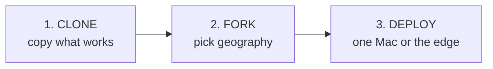
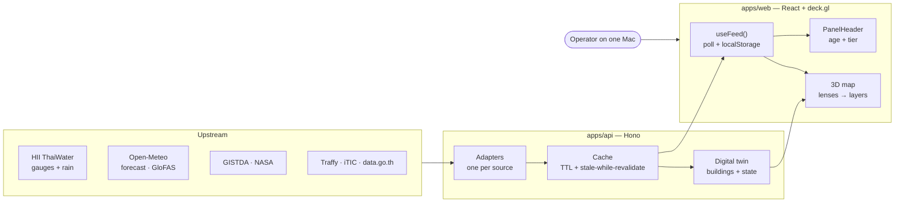

<div align="center">


# nst-control-tower
### Forkable municipal flood-first tower · Nakhon Si Thammarat

**Clone → pick geography → deploy.** One engine. Any city. This repo is the
flood-first build pointed at Nakhon Si Thammarat (นครศรีธรรมราช) — not a unique
snowflake.

[](https://react.dev)
[](https://deck.gl)
[](https://hono.dev)
[](#run)
[](LICENSE)

**Live:** [nst.nonarkara.org](https://nst.nonarkara.org/) · [nst-control-tower.pages.dev](https://nst-control-tower.pages.dev)

**[🇹🇭 อ่านภาษาไทย → README.th.md](README.th.md)** · 🇬🇧 English (this page)

</div>

---

## What this is

A **municipal control tower**: live hydrology, rainfall, satellite flood extent,
citizen reports, traffic, air, and open government data on one 3D map — plus a
flood **scenario simulator** against surveyed street elevations — so an operator
can answer, in the hours that matter:

> **What is happening right now, and where do I send help?**

NST sits at the foot of Khao Luang (1,835 m). Three watershed systems drain off
the mountain, through the Old Town, into the Pak Phanang basin — the same
geography that flooded under Tropical Storm Pabuk in 2019. Flooding is the
city's defining risk, so this fork leads with the **FLOOD** lens (gauges,
upstream→city cascade, HII flood marks, GloFAS, UNOSAT exposure).

This is **civic software**, MIT-licensed, running on a pnpm monorepo:

```
apps/api/         Hono API — Cloudflare Workers in production, Node on a Mac for local / 24-7
apps/web/         React 19 + Vite + deck.gl + MapLibre — the dashboard
packages/shared/  Types, locale, region config, source catalog (types.ts, locale.ts, campus.ts, sources.ts)
```

It is **not a demo**. Every number traces to a real upstream source or is
explicitly labeled modelled / scenario / offline — see [Honesty labels](#honesty).

---

## Philosophy

Five tenets. They are how this repo is meant to be used, not slogans on a slide.

| Tenet | What it means here |
|---|---|
| **Fork a city** | **CLONE** what already works → **FORK** the geography (bounds, buildings, watershed) → **DEPLOY**. Do not rewrite the engine. |
| **One Mac** | The whole tower runs on a single laptop: Vite on `:5173`, Node API on `:8794`, optional `launchd` + `caffeinate` for 24/7. Cloudflare Pages/Workers are the public edge, not a prerequisite to think. |
| **Bilingual** | Thai + English in the UI (`packages/shared/src/locale.ts` — `en` / `th` / `zh`). Campus names are trilingual. This README has a Thai twin. |
| **Honesty labels** | Every feed carries `fallbackTier`. The UI shows it. Simulated water is never dressed up as a live gauge. |
| **Not a unique snowflake** | NST is one geography on a shared engine (sibling forks exist). Same `NormalizedFeed<T>`, same lenses, same adapter contract. Your city is config + GeoJSON. |



---

## Ethical use

This project exists for **civic safety** — flood watch, dispatch, briefings —
not for theatre.

- **Do not fake an official city endorsement.** Pointing the map at Nakhon Si
  Thammarat (or any municipality) does **not** make this an official product of
  that city. Do not imply municipal, provincial, or national endorsement, branding,
  or operational authority **unless a file in the repository explicitly documents
  that relationship**. This repo does not currently contain such a file. The
  software is independent, MIT-licensed work by Non Arkaraprasertkul.
- **Do not impersonate a government system** in screenshots, tenders, or press.
  Say what it is: an open-source control tower *about* a place.
- **Do not hide modelled data.** Scenario / bathtub / forecast layers must keep
  their honesty chips (`SCENARIO`, `MODELLED`, `OFFLINE`).
- **Do not commit secrets.** Keys live in `apps/api/.env` (gitignored) or in
  deployment secret stores. Only `.env.example` is tracked. The SOURCES catalog
  shows `⚠ KEY MISSING` when an optional key is absent — that is the correct
  failure mode.
- **Respect upstream data.** HII, GISTDA, Open-Meteo, Traffy, OSM, and others
  own their feeds. Credit them; follow their terms.

If you fork this for another city, apply the same rules there.

---

## How it works

Every upstream source is fetched by **one adapter**, reshaped into the same
envelope, cached with stale-while-revalidate, and rendered by a panel that only
understands `NormalizedFeed<T>`.



**The adapter contract** (`apps/api/src/adapters/<name>.ts`): fetch with a
timeout, reshape to typed `features`, stamp `meta` — and **throw on genuine
failure**. Empty-on-error would look like “nothing’s wrong.” The cache then
serves last-known-good, or a calm `unavailable` / `scenario` feed on a cold
start.

```ts
interface NormalizedFeed<T> {
  features: T[];
  meta: SourceMeta; // source, fetchedAt, ageMinutes, fallbackTier, note?
}
```

<a id="honesty"></a>

| `fallbackTier` | Meaning | UI |
|---|---|---|
| `live` | Real sensor/API, within TTL | green |
| `database` | Twin Postgres record | `DB` |
| `cache` | Last good value (memory or `localStorage`) | `CACHE` |
| `reference` | Historical / statistical (e.g. UNOSAT 2021) | `REF` |
| `scenario` | Model output (bathtub sim, forecast grid) | `SCENARIO` / `MODELLED` |
| `unavailable` | Upstream down, no stale cache | `OFFLINE` — never faked |

**Lenses** (`apps/web/src/map/presets.ts` — nine views, one city):

| Lens | Purpose |
|---|---|
| **EXEC** | Strategic — municipal boundary, Old Town axis, city-scale KPIs |
| **OPS** | Day-to-day — 3D buildings, traffic, incidents, CCTV |
| **FLOOD** | Headline risk — gauges, flood marks, scenario slider, southern watch |
| **MOB** | Dispatch — roads, transit, traffic heatmap |
| **ENV** | Environment — flood polygons, waterways, air, solar |
| **EAR** | Earth observation — terrain, rain, heat, vegetation |
| **SAF** | Safety — flood zones, Traffy, hospitals / fire / police |
| **VIB** | Presentation — clean true-color satellite |
| **INT** | Forecast intelligence — rain/flood outlook wired to the map |

Deeper internals: [`docs/ARCHITECTURE.md`](docs/ARCHITECTURE.md) ·
[`docs/DATA-SOURCES.md`](docs/DATA-SOURCES.md) · coding conventions in
[`CLAUDE.md`](CLAUDE.md).

---

## Run it <a id="run"></a>

**Requirements** (from `package.json` / `packageManager`): Node **≥ 20**,
**pnpm 10.33.0**. One Mac is enough.

### 1. Install

```bash
git clone https://github.com/Nonarkara/nst-control-tower.git
cd nst-control-tower
pnpm install
```

### 2. Optional keys

```bash
cp apps/api/.env.example apps/api/.env
# paste keys if you have them — every key is optional
```

The dashboard degrades in public: a missing key hides that feed and surfaces a
note in SOURCES. **Never commit `.env`.** Names only (see
`apps/api/.env.example` and `docs/DATA-SOURCES.md`): `GEMINI_API_KEY`,
`AQICN_TOKEN`, `FMP_API_KEY`, `FRED_API_KEY`, `FACEBOOK_PAGE_TOKEN`,
`DATA_GO_TH_TOKEN`, `AIRLABS_API_KEY`, `GOOGLE_MAPS_API_KEY`, `GISTDA_API_KEY`,
`TMD_KEY`, `SUPABASE_DB_URL` / `DATABASE_URL`, MQTT, etc.

`apps/api/src/node.ts` loads `apps/api/.env` itself. Check presence (never
values) with:

```bash
curl -s http://127.0.0.1:8794/api/health/keys
```

### 3. Local dashboard — the path Vite actually uses

The web dev server (`apps/web/vite.config.ts`) proxies `/api` to
**`http://localhost:8794`**. The Node entry (`apps/api/src/node.ts`) listens on
**port 8794** by default (`HOST=127.0.0.1`). That pair is the local tower:

```bash
pnpm --filter @nst/api dev:node   # http://127.0.0.1:8794
pnpm --filter @nst/web dev        # http://localhost:5173  → proxies /api to :8794
```

Open **http://localhost:5173**.

Notes from the files, not folklore:

- `pnpm --filter @nst/api dev` runs **Wrangler** (`wrangler dev`, typically
  `:8787`). That is the Workers emulator, **not** the Vite proxy target.
- Root `pnpm dev` is `pnpm --parallel -r dev` (web Vite + Wrangler). Use the
  **Node** API above if you want the proxy to hit live adapters the same way the
  one-Mac daemon does.
- Override with `PORT` / `HOST` in `.env`. `.env.example` still mentions `8787`
  as a commented alternative; the committed Node default is **8794**.
- Twin persistence is optional: without `SUPABASE_DB_URL` / `DATABASE_URL` the
  twin stays in memory and hydrates from
  `apps/web/public/geo/nst/buildings.geojson` on boot.

### 4. One Mac, 24/7

Production comment in `apps/api/src/node.ts`: a long-lived Node process (Thai
government endpoints that local `workerd` TLS can reject), disk cache, 5-minute
prewarm, optional MQTT.

Committed wrappers (edit **paths** for your machine before loading):

| File | Role |
|---|---|
| [`infra/run-nst-api.sh`](infra/run-nst-api.sh) | `caffeinate -is` + `pnpm start:node` on `:8794` |
| [`infra/org.nonarkara.nst-api.plist`](infra/org.nonarkara.nst-api.plist) | `launchd` KeepAlive, `RunAtLoad`, logs under `var/` |

Copy the plist to `~/Library/LaunchAgents/`, point `WorkingDirectory` /
`ProgramArguments` at **your** clone, keep keys in `.env` (not in git).

### 5. Tests and typecheck

```bash
pnpm --filter @nst/shared typecheck
pnpm --filter @nst/web typecheck
pnpm --filter @nst/api typecheck

pnpm --filter @nst/shared test
pnpm --filter @nst/api test
pnpm --filter @nst/web test
pnpm --filter @nst/web test:e2e    # Playwright smoke — map, lenses, honesty chips
```

CI (`.github/workflows/test.yml`) runs typecheck + unit + E2E on every PR.
Deploy (`.github/workflows/deploy.yml`) waits for Test on `main`, then:

- Web: `pnpm --filter @nst/web build` with `VITE_API_BASE_URL` →
  `wrangler pages deploy` project **`nst-control-tower`**
- API: `pnpm --filter @nst/api deploy` (Worker name
  **`nst-control-tower-api`** in `apps/api/wrangler.toml`)

---

## Fork a city

NST is the reference geography. The engine is meant to be re-pointed — clone,
change place, ship. Paths below are what this repo actually hardcodes today.

### 1. Clone

Fork [Nonarkara/nst-control-tower](https://github.com/Nonarkara/nst-control-tower)
(or `git clone`). Keep the monorepo. Do not start from a blank Vite app.

### 2. Pick geography

**Region config** — `packages/shared/src/campus.ts` (`NST`):

- `id`, trilingual `name` (`en` / `th` / `zh`)
- `center` as **`[lng, lat]`** (deck.gl order)
- `innerBounds` / `outerBounds` (municipality vs map coverage)
- `defaultView` (longitude, latitude, zoom, pitch, bearing)
- `surroundingRoads`

Also retarget, if your hydrology is not Tha Dee / Khao Luang:

- `WATERSHED_FORECAST_POINTS` in the same file (order is API/web aligned)
- `WATERSHED_ZONES` in `apps/web/src/lib/watershed.ts` (Thai/English names,
  amphoe matchers)
- `NST_PROVINCE_BBOX` for province-scale adapters

**Buildings and static GeoJSON** — today loaders point at `/geo/nst/…`
(`apps/web/src/App.tsx`, twin hydrate in `apps/api/src/node.ts`). Either:

- replace files under `apps/web/public/geo/nst/`, or
- add `apps/web/public/geo/<city>/` and retarget those paths.

Minimum useful set (see `apps/web/scripts/extract-nst-geo.mjs`):
`buildings.geojson`, `boundary.geojson`, `roads.geojson`, `waterways.geojson`,
`civic-pois.geojson`. Adapt that script’s `BBOX` / `CENTER` and run from
`apps/web/`:

```bash
node scripts/extract-nst-geo.mjs
```

**Source catalog** — trim or extend `packages/shared/src/sources.ts`. For every
new live route, add a row to `API_PATH_TO_ADAPTER` in
`apps/web/src/lib/sourceCatalog.ts` or the SOURCES modal will miss health chips.

**News / keywords** — city-name filters live in the relevant adapters; grep and
replace.

**Public URLs** — `apps/web/index.html` (canonical, Open Graph, CSP,
`preconnect`) and `apps/web/src/lib/apiBase.ts` (`NST_API_BASE`,
`VITE_API_BASE_URL`). Wrangler / Pages project names:
`nst-control-tower`, `nst-control-tower-api`.

### 3. Deploy

Local: the one-Mac pair in [Run it](#run). Public: Cloudflare Pages + Worker
(see `.github/workflows/deploy.yml`), or keep Node behind a tunnel if you need
the same process that talks to Thai government TLS.

Then add a row to [`DEPLOYMENTS.md`](DEPLOYMENTS.md). Do **not** add a city
there as “official” unless the repo documents that endorsement.

---

## Live URL

| Surface | URL | Where it is declared |
|---|---|---|
| Canonical dashboard | [https://nst.nonarkara.org/](https://nst.nonarkara.org/) | `apps/web/index.html` (`link rel="canonical"`, Open Graph) |
| Cloudflare Pages | [https://nst-control-tower.pages.dev](https://nst-control-tower.pages.dev) | [`DEPLOYMENTS.md`](DEPLOYMENTS.md) |
| Production API | [https://nst-control-tower-api.drnon.workers.dev](https://nst-control-tower-api.drnon.workers.dev) | `apps/web/src/lib/apiBase.ts` (`NST_API_BASE`) |

Custom API hosts can be set at build time with `VITE_API_BASE_URL`. Dev mode
with no override uses relative `/api` (the Vite proxy).

---

## License

MIT — [`LICENSE`](LICENSE). Copyright (c) 2026 Non Arkaraprasertkul.

Data belongs to its providers: HII (Hydro-Informatics Institute), Open-Meteo,
GISTDA, NASA, UNOSAT/UNITAR, data.go.th, Traffy Fondue, OpenStreetMap, and
others. The in-app **SOURCES** catalog is the live list with health status.

Software ≠ official city endorsement. See [Ethical use](#ethical-use).
