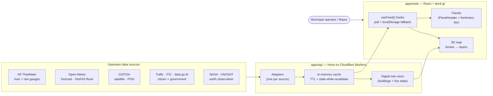
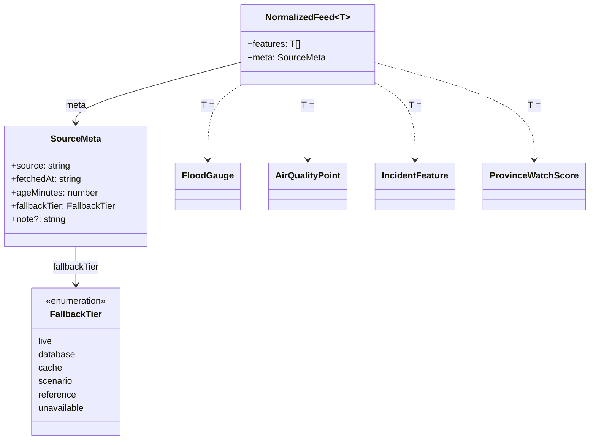
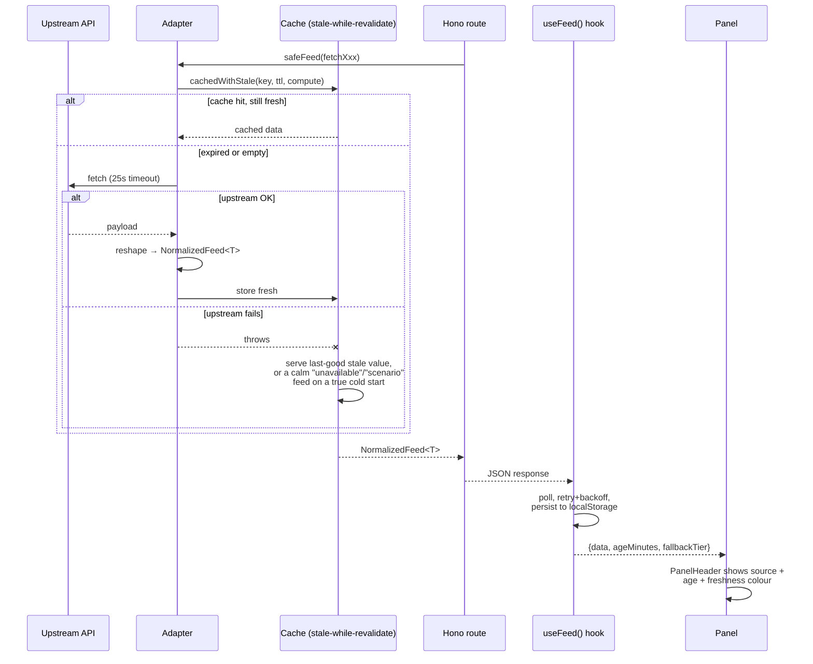

<div align="center">

# Nakhon Si Thammarat Smart City Dashboard
### เทศบาลนครนครศรีธรรมราช — Municipal Control Tower

**A free, open-source, real-time intelligence dashboard for Nakhon Si Thammarat City
Municipality, Southern Thailand — built flood-first, because flooding is the city's
defining risk.**

[](https://react.dev)
[](https://deck.gl)
[](https://hono.dev)
[](#proof)
[](LICENSE)

**[🇹🇭 อ่านภาษาไทย → README.th.md](README.th.md)** · 🇬🇧 English (this page)

</div>

---

## What is this? <a id="what"></a>

NST sits at the foot of Khao Luang (1,835 m, the South's highest peak). Three watershed
systems drain off the mountain, through the Old Town, into the Pak Phanang basin — the
same geography that flooded under Tropical Storm Pabuk in 2019. This dashboard exists to
answer one question fast, during the hours that matter: **"What is happening right now,
and where do I send help?"**

It folds dozens of live data feeds — river discharge, rainfall, satellite flood extent,
air quality, traffic, citizen reports, maritime AIS, government open data — onto a single
3D map of the city, and adds a flood **scenario simulator** so an operator can test "what
happens at water level X" against real surveyed street elevations before it happens.

**This is not a demo.** Every number on screen traces back to a real upstream source or is
explicitly labeled as modelled/scenario — see [Data honesty](#honesty) below.

## Proof <a id="proof"></a>

| | |
|---|---|
| **1,927** | tappable 3D building footprints |
| **70** | cataloged data sources (27 live today) |
| **1,168** | automated unit tests, plus 18 Playwright E2E smoke tests |
| **9** | map lenses — one city, many views |
| **0** | secrets in the repo — every key is an environment variable |

## System architecture <a id="architecture"></a>

A pnpm monorepo, three workspaces:

```
apps/api/         Hono API on Cloudflare Workers — one adapter per data source
apps/web/         React 19 + Vite + deck.gl + MapLibre — the dashboard itself
packages/shared/  Shared TypeScript types + region config (types.ts, sources.ts, campus.ts)
```



**The adapter pattern.** Every upstream source gets exactly one adapter in
`apps/api/src/adapters/<name>.ts`. An adapter fetches (with a timeout), reshapes the
payload into typed `features`, stamps a `meta` block describing freshness, and — this is
the part that matters — **throws on genuine failure** instead of silently returning empty
data, so the cache layer's stale-while-revalidate logic can serve the last known-good
value instead of a fabricated "nothing's wrong" response.

## The data contract — `NormalizedFeed<T>` <a id="data-structure"></a>

Every one of the 70 cataloged sources — river gauges, satellite imagery, citizen reports,
market data — is reshaped into **the same envelope** before it ever reaches a UI panel.
This is the single most important design decision in the codebase: a panel never has to
know or care what upstream API produced its data.



One feed's round trip, end to end:



## Data honesty: real vs. simulated <a id="honesty"></a>

Every data point on screen carries a `fallbackTier`, and the UI always shows it — nothing
simulated is ever presented as if it were live.

| Tier | Meaning |
|---|---|
| `live` | Real sensor/API data, fetched within the adapter's TTL |
| `database` | Persisted in the digital twin's Postgres store — authoritative record |
| `cache` | Last good value, served from browser localStorage while a refresh is in flight |
| `reference` | Historical/statistical dataset (e.g. 17-year satellite flood-frequency) — not live-updating |
| `scenario` | Model output — e.g. the flood "bathtub" simulator, a forecast rain grid |
| `unavailable` | Upstream is down and there's no stale cache — shown as an honest error, never faked |

## Lenses — one city, many views <a id="lenses"></a>

| Lens | Purpose |
|---|---|
| **EXEC** | Strategic overview — municipal boundary, city-scale KPIs |
| **OPS** | Day-to-day operations — every building in 3D, traffic, incidents, CCTV |
| **FLOOD** | The headline risk — river gauges, surveyed flood marks, the scenario simulator, satellite flood exposure, and southern-region watch scores |
| **MOB** | Mobility & dispatch — road network, transit, traffic heatmap |
| **ENV** | Environment — flood-risk zones, waterways, land cover, air quality, solar potential |
| **EAR** | Earth observation — satellite rain, heat, vegetation |
| **SAF** | Safety — flood zones, citizen reports, hospitals/fire/police |
| **VIB** | Presentation mode — clean true-color satellite for briefings |
| **INT** | Forecast intelligence — rain/flood outlook layers |

## The southern-region flood layer <a id="flooddash"></a>

Beyond NST-local monitoring, the **FLOOD** lens also carries peninsula-wide situational
awareness: a watch score for all 14 southern provinces (water level 50% · rainfall 30% ·
forecast 20%) and a GloFAS river-discharge cascade across five key reaches (Hat Yai, Tapi,
Pattani, Tha Dee, Pak Phanang). This logic is a direct, verified port of an independent
flood-monitoring engine, re-scoped to run against the same live upstream sources with no
external server dependency.

## Quick start <a id="quickstart"></a>

```bash
pnpm install
pnpm dev                    # all workspaces
# or individually:
pnpm --filter web dev       # frontend → http://localhost:5173
pnpm --filter api dev       # API     → http://localhost:3000 (wrangler dev)
```

```bash
pnpm tsc --noEmit                    # type-check the whole repo
pnpm --filter @nst/shared test       # 40 tests
pnpm --filter @nst/api test          # 554 tests
pnpm --filter @nst/web test          # 574 tests
pnpm --filter @nst/web test:e2e      # 18 Playwright smoke tests
```

CI (`.github/workflows/test.yml`) runs type-check + unit + E2E on every PR; deploy to
Cloudflare Pages/Workers runs only after the Test workflow passes.

## Fork it for your city <a id="fork"></a>

This engine is geography-agnostic. To re-point it at another municipality:

1. **Region config** — `packages/shared/src/campus.ts` (center, bounds, name).
2. **Buildings** — drop your city's OSM building GeoJSON at `apps/web/public/geo/<city>/`.
3. **Source catalog** — trim or extend `packages/shared/src/sources.ts`.
4. **Health mapping** — update `API_PATH_TO_ADAPTER` in `apps/web/src/lib/sourceCatalog.ts`
   so the SOURCES modal can track health for any new routes.

Deeper notes: [`docs/ARCHITECTURE.md`](docs/ARCHITECTURE.md) ·
[`docs/DATA-SOURCES.md`](docs/DATA-SOURCES.md) · conventions in [`CLAUDE.md`](CLAUDE.md).

## License & credits

MIT — see [`LICENSE`](LICENSE). Data belongs to its respective providers: HII
(Hydro-Informatics Institute), Open-Meteo, GISTDA, NASA, UNOSAT/UNITAR, data.go.th,
Traffy Fondue, OpenStreetMap, and others — see the in-app SOURCES catalog for the full,
current list with live health status.
