<div align="center">

# ยะลา สมาร์ทซิตี้ · Yala Smart City
### แดชบอร์ดเมืองอัจฉริยะ เทศบาลนครยะลา — Dr Non's Yala Super Dashboard

**แดชบอร์ดข่าวกรองเมืองแบบเรียลไทม์ ฟรีและโอเพนซอร์ส สำหรับเทศบาลนครยะลา ชายแดนใต้**

[](https://react.dev)
[](https://deck.gl)
[](https://hono.dev)
[](#พิสูจน์)
[](LICENSE)

🇹🇭 ภาษาไทย (หน้านี้) · **[🇬🇧 English → README.md](README.md)**

</div>

> **วิธีอ่าน repo นี้** — *ภาพ* เป็นภาษาไทย สำหรับประชาชนและเจ้าหน้าที่ ส่วน *ตัวหนังสือ*
> (README, เอกสาร, โค้ด) เป็นภาษาอังกฤษ เพราะคอมพิวเตอร์และนักพัฒนาอ่านได้แม่นยำกว่า —
> เลื่อนดูภาพเพื่อเข้าใจเรื่องราว อ่านตัวหนังสือเพื่อดูรายละเอียด

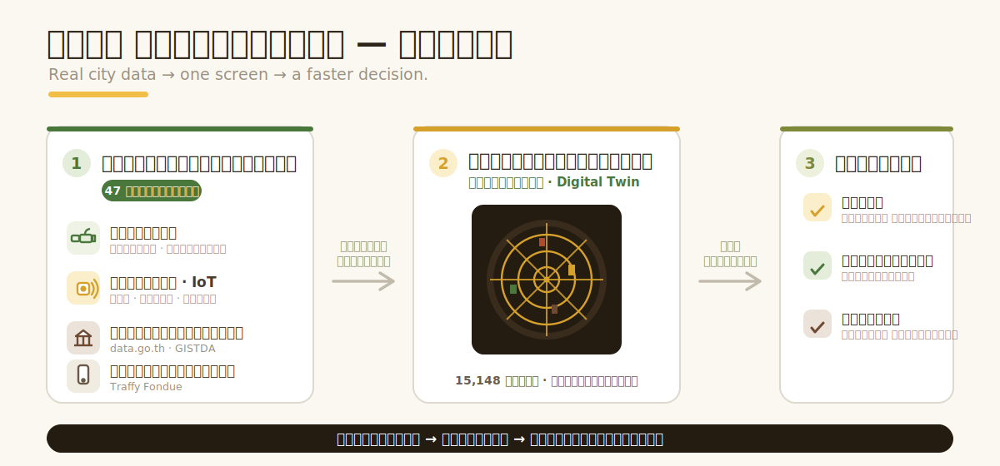

---

## เรื่องราวใน 4 ภาพ

4 คำถามที่คนทั่วไปอยากรู้ — ตอบด้วยภาพละ 1 คำถาม

### 1 · ทำไมต้องมี? — Why
ทั้งเมืองเคยอยู่ในไฟล์กระจัดกระจาย PDF และแชต หลายหน่วยงาน กว่าจะรวมเป็นภาพได้ก็สายไปแล้ว
ที่ชายแดนใต้ — น้ำท่วม ความปลอดภัย เศรษฐกิจ — “รู้ช้า” ไม่ได้

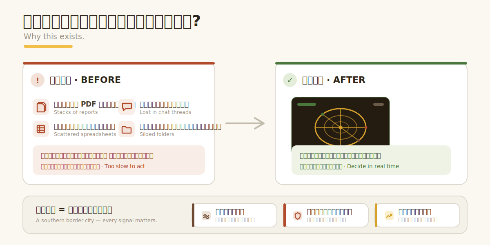

### 2 · ทำงานยังไง? — How
ทุกแหล่งข้อมูลถูกดึงด้วย **adapter** แปลงให้เป็นรูปแบบมาตรฐานเดียวกัน (**NormalizedFeed**)
เขียนลง **แฝดดิจิทัล (digital twin)** ของเมือง แล้วแสดงบน **แดชบอร์ด** — ทำงานเองตลอด 24 ชม.
รีเฟรชทุก 2–30 นาที

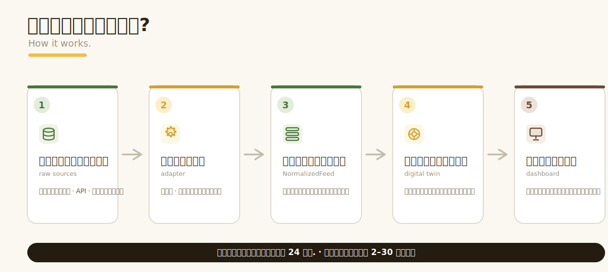

### 3 · รู้ได้ยังไงว่าของจริง? — Proof <a id="พิสูจน์"></a>
ไม่ใช่สไลด์ — **15,148** อาคารแตะได้ทุกหลัง, **47** แหล่งข้อมูลที่ต่อจริง, ฟีด **สด**
รีเฟรชอัตโนมัติ, **521** การทดสอบผ่านทั้งหมด, **3** หน้าจอมือถือ, และเป็น **โอเพนซอร์ส**
ทุกตัวเลขตรวจสอบย้อนกลับไปที่โค้ดจริงได้

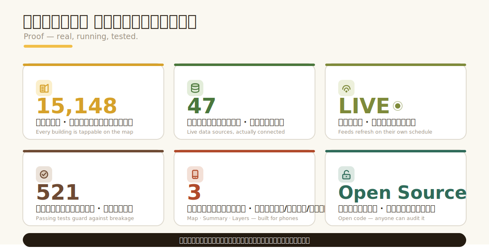

### 4 · ใครได้อะไร แล้วทำไมถึงอยู่ได้? — People
นายกฯ เจ้าหน้าที่ ประชาชน และพันธมิตร (depa ฯลฯ) ต่าง **ให้** และ **ได้** —
เพราะทุกฝ่ายได้ประโยชน์กลับ วงจรจึงหล่อเลี้ยงตัวเอง ไม่ใช่แค่เดโมครั้งเดียว

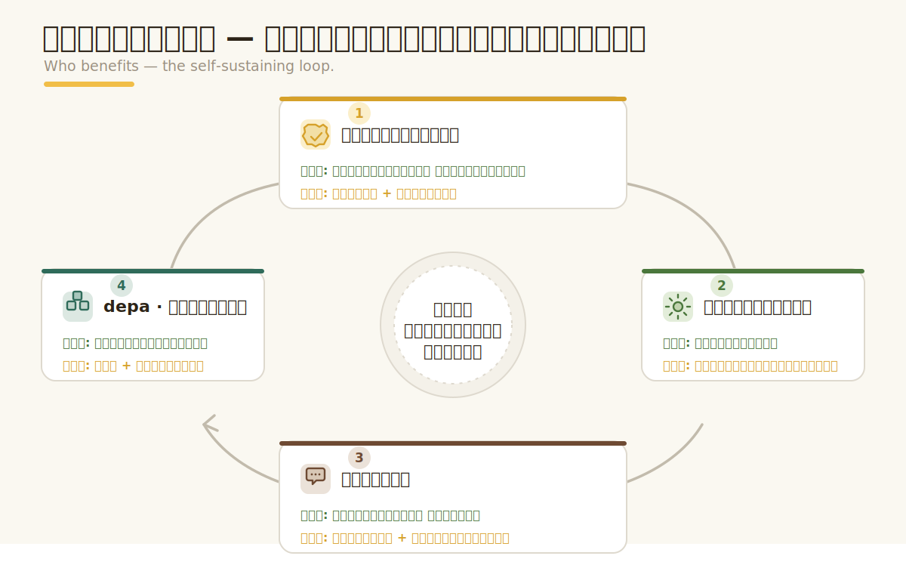

---

## บทต่อไป

เรื่องราวภาพชุดเดียวกันต่อเนื่อง — ภาพละหนึ่งเรื่อง ป้ายภาษาไทย ทั้งหมดอยู่ใน
[`docs/story/`](docs/story/) · สไตล์ภาพที่ [`docs/STYLE.md`](docs/STYLE.md)

**แผนที่เมือง 3 มิติ** — 2D/3D · อาคารแยกสีตามประเภท · เข็มทิศ · พิกัดสด · แตะอาคารใส่ข้อมูลได้
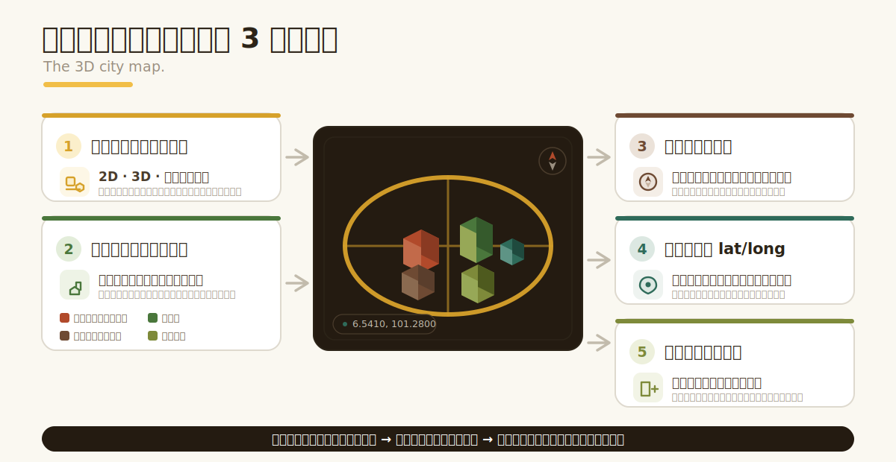

**เมืองเดียว หลายมุมมอง** — EXEC · OPS · MOB · MAR · ENV · EAR · SAF · VIB · INT
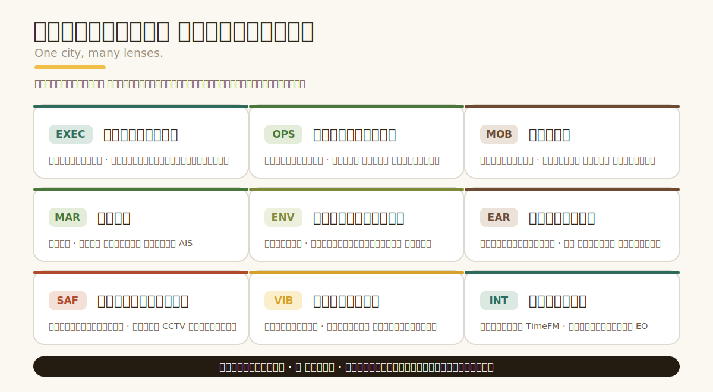

**ใช้บนมือถือ** — 3 หน้าจอ ใช้นิ้วง่าย: แผนที่ · สรุป · ชั้นข้อมูล
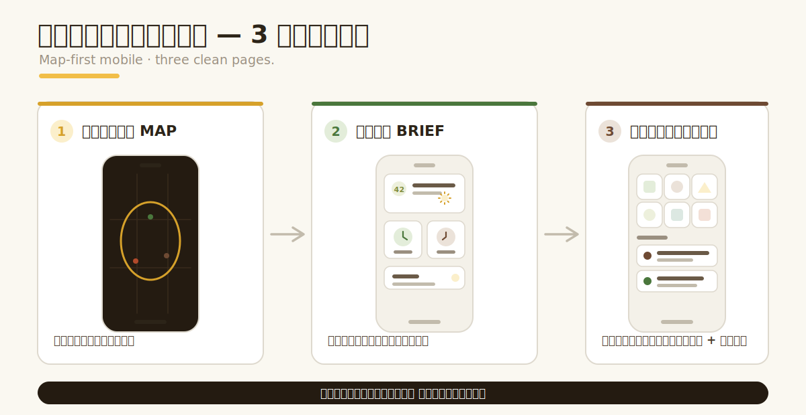

**แฝดดิจิทัล** — ทุกอาคารมี id คงที่ และใส่ข้อมูลได้ (เซนเซอร์ · การแจ้งเหตุ · ประเภท)
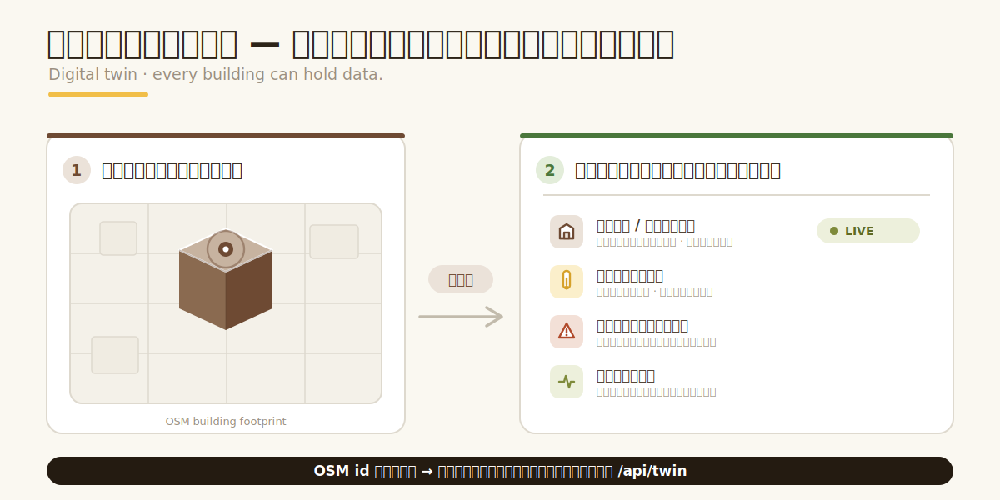

**47 แหล่งข้อมูล แยกตามหมวด** — อากาศ · น้ำท่วม · ดาวเทียม · จราจร · ทะเล · ภาครัฐ&สังคม
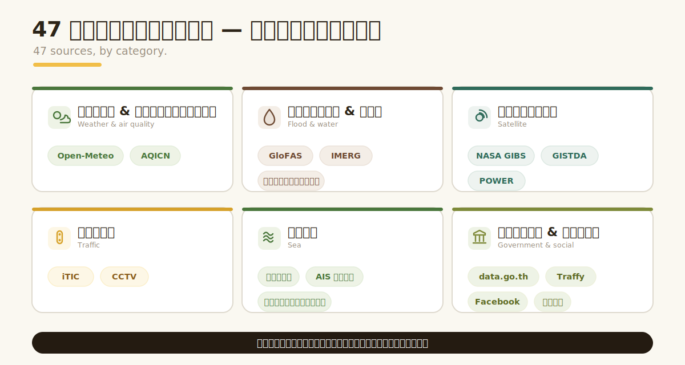

**ระบบไม่ดับ** — สด → แคช → จำลอง → ไม่มีข้อมูล · จอไม่เคยว่างเปล่า
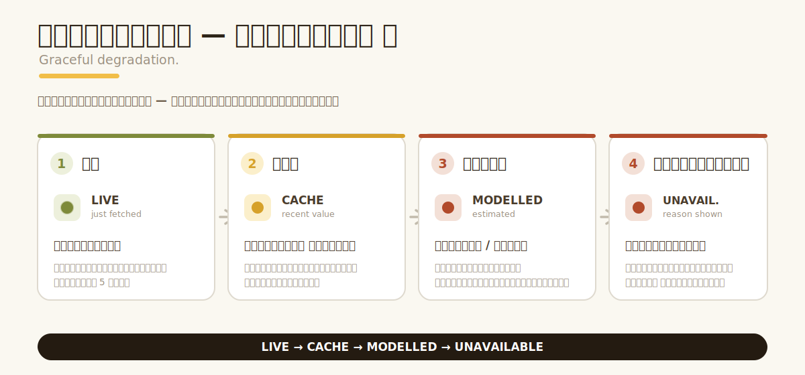

**เชื่อใจได้ ตรวจสอบได้** — ข้อมูลสาธารณะ · ไม่มีความลับ · โอเพนซอร์ส · ตรวจสอบย้อนกลับได้
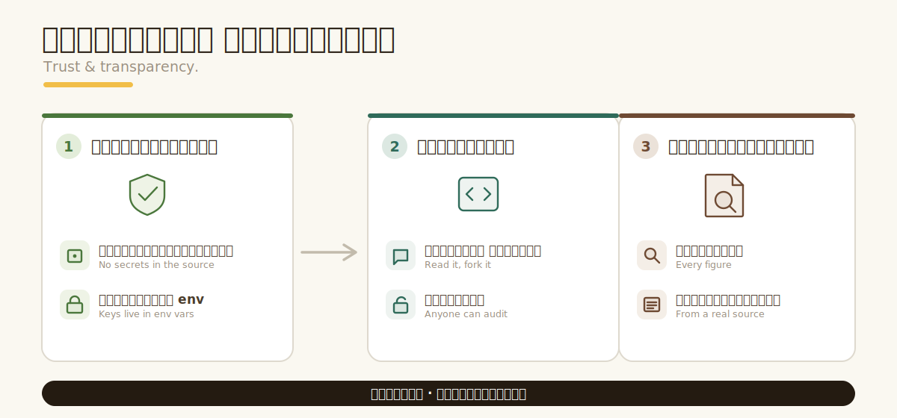

**ทำเมืองของคุณได้** — คัดลอก → ตั้งค่าเมือง → ขึ้นออนไลน์
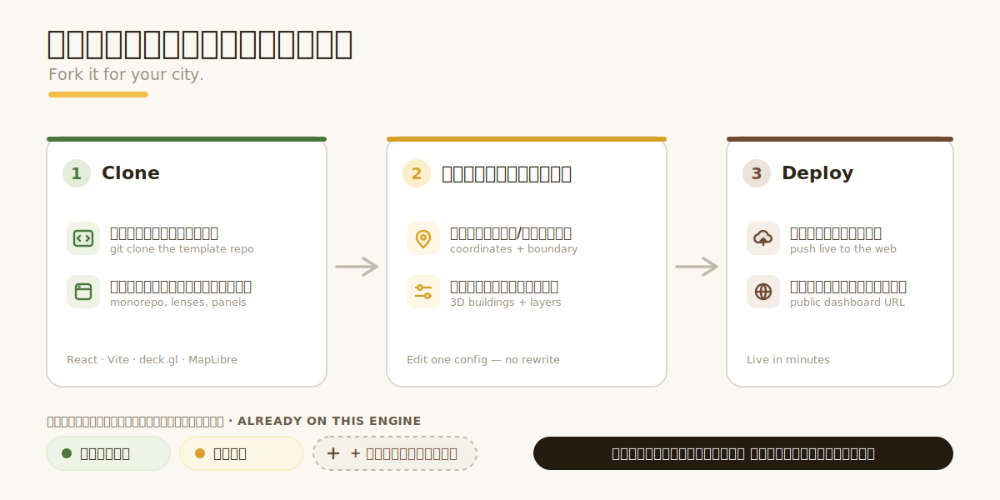

**สถาปัตยกรรม (สำหรับนักพัฒนา)** — monorepo: `apps/api` · `apps/web` · `packages/shared`
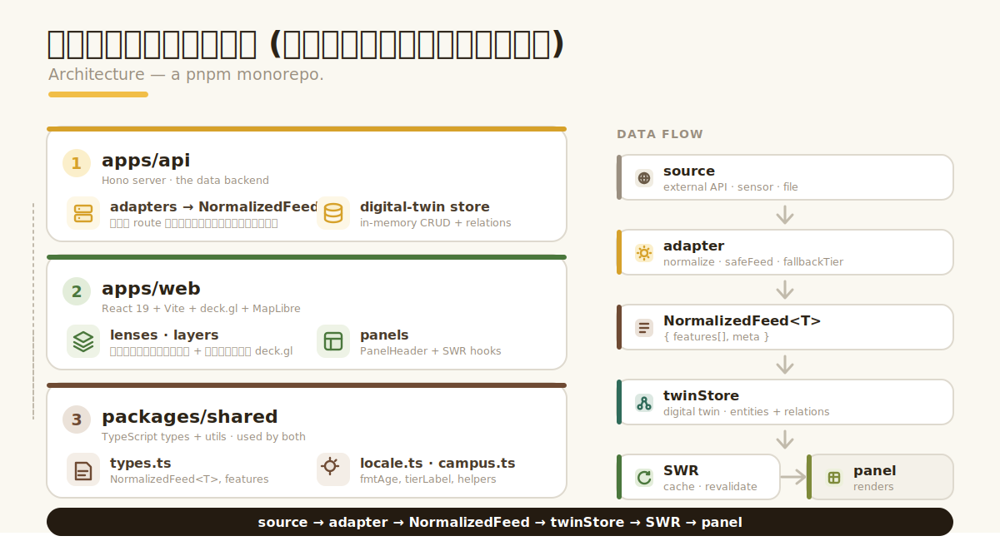

---

## คืออะไร?

ยะลา สมาร์ทซิตี้ คือ **“ศูนย์บัญชาการเมือง”** — รวมข้อมูลสดหลายสิบแหล่ง ทั้งอากาศ คุณภาพอากาศ
น้ำท่วม/ปริมาณน้ำในแม่น้ำ อุบัติเหตุจราจร ข้อมูลทะเล/ชายฝั่ง ภาพถ่ายดาวเทียม การแจ้งเหตุของประชาชน
และข้อมูลเปิดภาครัฐ — ไว้บนแผนที่ 3 มิติของเมืองเดียว เพื่อตอบคำถามสำคัญในวันที่ยุ่ง:
**“ตอนนี้ผมต้องทำอะไร?”**

เป็นพี่น้องกับ [`chonburi-control-tower`](https://github.com/Nonarkara/chonburi-control-tower) —
เครื่องยนต์เดียวกัน เปลี่ยนมาชี้ที่ยะลา (เทศบาลนครยะลา)

## ฟีเจอร์หลัก

- **แผนที่เมือง 3 มิติ** — อาคารทั้ง 15,148 หลังจาก OSM ยกขึ้นเป็น 3 มิติ สลับ **2D / 3D / ใต้ดิน** ได้
- **แยกสีตามประเภท** — อาคารแต้มสีตามชนิด (โรงพยาบาล วัด โรงเรียน ตลาด…) พร้อมคำอธิบายสีบนแผนที่ อาคารที่ยังไม่มีข้อมูลเป็นสีกลาง และใส่ข้อมูลรายอาคารได้ผ่าน API แฝดดิจิทัล
- **เข็มทิศ + พิกัดสด** — เข็มทิศกดรีเซ็ตทิศเหนือ และพิกัด lat/long ตามเมาส์
- **เลนส์ (มุมมอง)** — เมืองเดียว หลายมุมมอง: `EXEC · OPS · MOB · MAR · ENV · EAR · SAF · VIB · INT`
- **มือถือเน้นแผนที่** — 3 หน้าจอ ใช้นิ้วง่าย: **แผนที่ · สรุป · ชั้นข้อมูล**
- **ไม่ล่มง่าย** — ทุกฟีดบอกความสด (สด → แคช → จำลอง → ไม่มีข้อมูล) จอไม่เคยว่างเปล่า แค่บอกตรง ๆ ว่าข้อมูลเก่าแค่ไหน
- **ไม่มีความลับในโค้ด** — คีย์ทั้งหมดอยู่ใน environment variable เปิดโค้ดอ่านได้อย่างปลอดภัย

## เริ่มใช้งาน

```bash
pnpm install
pnpm dev                 # รันทุก workspace
pnpm --filter web dev    # เฉพาะหน้าเว็บ → http://localhost:5173
pnpm --filter api dev    # เฉพาะ API     → http://localhost:3000
```

## สถาปัตยกรรม

monorepo แบบ pnpm:

| Workspace | คืออะไร |
|---|---|
| `apps/api/` | **Hono** API — adapter แต่ละตัวคืนค่าเป็น `NormalizedFeed<T>` และ store ของแฝดดิจิทัล |
| `apps/web/` | แดชบอร์ด **React 19 + Vite + deck.gl + MapLibre** — เลนส์ เลเยอร์แผนที่ พาเนล |
| `packages/shared/` | type + utility ที่ใช้ร่วมกัน (`types.ts`, `locale.ts`) |

รายละเอียด: [`docs/ARCHITECTURE.md`](docs/ARCHITECTURE.md) · [`docs/DATA-SOURCES.md`](docs/DATA-SOURCES.md)

## ทำเมืองของคุณเอง

ออกแบบมาให้เปลี่ยนเมืองได้ — clone แล้วแก้ค่า campus config (จุดศูนย์กลาง ขอบเขต ไฟล์อาคาร
รายการแหล่งข้อมูล) ก็ได้ศูนย์บัญชาการของเทศบาลคุณ ตอนนี้ยะลา ชลบุรี และมหาวิทยาลัยหนึ่ง
รันบนเครื่องยนต์เดียวกันนี้

## สัญญาอนุญาต & เครดิต

MIT — สร้างโดย **ดร.นนท์ อารักษ์ประเสริฐกุล** ([nonarkara.org](https://nonarkara.org))
ภายใต้โครงการ [SLIC Index](https://github.com/Nonarkara/SLIC-Index) ร่วมกับ depa และพันธมิตร
ข้อมูลเป็นของผู้ให้บริการแต่ละราย (NASA, GISTDA, Open-Meteo, data.go.th, OpenStreetMap ฯลฯ —
ดูรายการในแคตตาล็อก SOURCES ในแอป)
