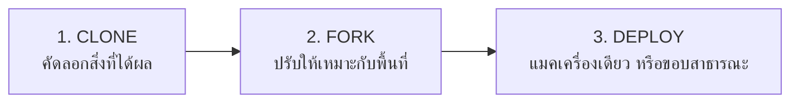
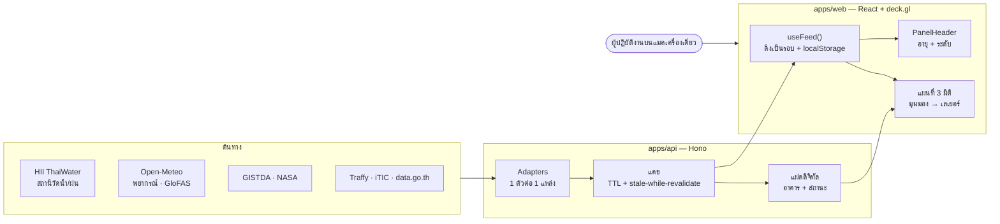

<div align="center">


# nst-control-tower
### หอควบคุมเทศบาลที่ยึดน้ำท่วมเป็นแกน · นครศรีธรรมราช

**คัดลอก → เลือกภูมิศาสตร์ → ติดตั้ง** เครื่องยนต์เดียว ใช้ได้ทุกเมือง
ที่เก็บนี้คือรุ่นที่ยึดน้ำท่วมเป็นแกน ชี้ไปที่นครศรีธรรมราช — ไม่ใช่ระบบที่ทำได้ที่เดียว

[](https://react.dev)
[](https://deck.gl)
[](https://hono.dev)
[](#run)
[](LICENSE)

**ใช้งานจริง:** [nst.nonarkara.org](https://nst.nonarkara.org/) · [nst-control-tower.pages.dev](https://nst-control-tower.pages.dev)

🇹🇭 ภาษาไทย (หน้านี้) · **[🇬🇧 English → README.md](README.md)**

</div>

---

## นี่คืออะไร

**ศูนย์บัญชาการเมือง (municipal control tower):** รวมอุทกวิทยาสด ปริมาณฝน
พื้นที่น้ำท่วมจากดาวเทียม รายงานประชาชน จราจร อากาศ และข้อมูลเปิดภาครัฐ
ลงบนแผนที่ 3 มิติเดียว — พร้อมเครื่องมือ **จำลองสถานการณ์น้ำท่วม** เทียบกับระดับถนนที่สำรวจจริง
เพื่อให้ผู้ปฏิบัติงานตอบคำถามในชั่วโมงที่สำคัญ:

> **ตอนนี้เกิดอะไรขึ้น และควรส่งความช่วยเหลือไปที่ไหน**

นครศรีธรรมราชตั้งอยู่เชิงเขาหลวง (1,835 เมตร) ระบบลุ่มน้ำ 3 สายไหลลงจากภูเขา
ผ่านย่านเมืองเก่า ลงสู่ลุ่มน้ำปากพนัง — ภูมิประเทศเดียวกับที่เคยน้ำท่วมใหญ่จากพายุปาบึก ปี 2562
น้ำท่วมคือความเสี่ยงหลักของเมือง ดังนั้นรุ่นนี้จึงเปิดด้วยมุมมอง **FLOOD**
(สถานีวัดน้ำ ลำดับต้นน้ำ→เมือง รอยน้ำท่วม HII, GloFAS, UNOSAT)

นี่คือ **ซอฟต์แวร์เพื่อความปลอดภัยสาธารณะ** สัญญาอนุญาต MIT ในโมโนรีโป pnpm:

```
apps/api/         Hono API — Cloudflare Workers ตอนใช้งานจริง, Node บน Mac สำหรับเครื่องเดียว / 24 ชม.
apps/web/         React 19 + Vite + deck.gl + MapLibre — ตัวแดชบอร์ด
packages/shared/  ชนิดข้อมูล ภาษา ค่าคอนฟิกภูมิภาค ทะเบียนแหล่งข้อมูล
```

**นี่ไม่ใช่ demo** ตัวเลขทุกตัวสืบไปถึงแหล่งต้นทางจริง หรือติดป้ายชัดว่าเป็นแบบจำลอง / สถานการณ์ / ออฟไลน์
ดู [ป้ายความซื่อสัตย์](#honesty)

---

## ปรัชญา

ห้าหลัก — เป็นวิธีใช้ที่เก็บนี้ ไม่ใช่สโลแกนบนสไลด์

| หลัก | ความหมายในที่นี้ |
|---|---|
| **แยกเมือง (fork a city)** | **CLONE** สิ่งที่ได้ผล → **FORK** ภูมิศาสตร์ (ขอบเขต อาคาร ลุ่มน้ำ) → **DEPLOY** อย่าเขียนเครื่องยนต์ใหม่ |
| **แมคเครื่องเดียว** | ทั้งหอควบคุมรันบนโน้ตบุ๊กเครื่องเดียว: Vite ที่ `:5173` API Node ที่ `:8794` จะเปิด `launchd` + `caffeinate` ให้ทำงาน 24 ชม. ก็ได้ Cloudflare เป็นขอบสาธารณะ ไม่ใช่เงื่อนไขที่จะเริ่มคิด |
| **สองภาษา** | ไทย + อังกฤษใน UI (`locale.ts` — `en` / `th` / `zh`) ชื่อเมืองมีสามภาษา README คู่ภาษาไทยอยู่หน้านี้ |
| **ป้ายความซื่อสัตย์** | ทุกฟีดมี `fallbackTier` UI แสดงป้ายนี้ น้ำจำลองไม่ถูกแต่งเป็นสถานีวัดสด |
| **ไม่ใช่เกล็ดหิมะเฉพาะตน** | นครศรีธรรมราชคือภูมิศาสตร์หนึ่งบนเครื่องยนต์ร่วม (มีโฟร์กพี่น้อง) สัญญา `NormalizedFeed<T>` มุมมอง และ adapter ชุดเดียวกัน เมืองของคุณคือคอนฟิก + GeoJSON |


```mermaid
flowchart LR
    C["1. CLONE<br/>คัดลอกสิ่งที่ได้ผล"] --> F["2. FORK<br/>ปรับให้เหมาะกับพื้นที่"]
    F --> D["3. DEPLOY<br/>แมคเครื่องเดียว หรือขอบสาธารณะ"]
```

---

## การใช้ตามจริยธรรม

โครงการนี้มีไว้เพื่อ **ความปลอดภัยของเมือง** — เฝ้าระวังน้ำท่วม สั่งการ บรรยายสรุป — ไม่ใช่เพื่อการแสดง

- **อย่าแอบอ้างว่าเทศบาลรับรอง** การชี้แผนที่ไปที่นครศรีธรรมราช (หรือเทศบาลใด) **ไม่ได้** ทำให้ระบบนี้เป็นผลิตภัณฑ์ทางการของเมืองนั้น ห้ามสื่อว่ามีตราสัญลักษณ์ อำนาจปฏิบัติการ หรือการรับรองจากเทศบาล / จังหวัด / รัฐ **เว้นแต่มีไฟล์ในที่เก็บนี้ระบุความสัมพันธ์นั้นชัดเจน** ขณะนี้ยังไม่มีไฟล์เช่นนั้น ซอฟต์แวร์นี้เป็นงานอิสระ สัญญาอนุญาต MIT โดย นนท์ อัครประเสริฐกุล
- **อย่าปลอมเป็นระบบราชการ** ในภาพหน้าจอ เอกสารประกวดราคา หรือข่าว ให้พูดตามจริง: หอควบคุมโอเพนซอร์ส *เกี่ยวกับ* สถานที่หนึ่ง
- **อย่าซ่อนข้อมูลจำลอง** ชั้นสถานการณ์ / อ่างอาบน้ำ / พยากรณ์ต้องคงชิปความซื่อสัตย์ (`SCENARIO`, `MODELLED`, `OFFLINE`)
- **อย่าใส่ความลับลงกิต** คีย์อยู่ใน `apps/api/.env` (ไม่ติดตามในกิต) หรือในที่เก็บซีเคร็ตตอนติดตั้ง ติดตามเฉพาะ `.env.example` หน้าต่าง SOURCES แสดง `⚠ KEY MISSING` เมื่อคีย์ขาด — นั่นคือพฤติกรรมที่ถูกต้อง
- **เคารพแหล่งข้อมูลต้นทาง** HII, GISTDA, Open-Meteo, Traffy, OSM ฯลฯ เป็นเจ้าของฟีด ให้เครดิต และปฏิบัติตามข้อกำหนดของเขา

ถ้าแยกไปใช้กับเมืองอื่น ให้ใช้กฎชุดเดียวกันที่นั่น

---

## ทำงานอย่างไร

ทุกแหล่งต้นทางถูกดึงด้วย **adapter หนึ่งตัว** แปลงให้อยู่ในซองเดียวกัน
แคชแบบ stale-while-revalidate แล้วแผงข้อมูลเข้าใจแค่ `NormalizedFeed<T>`


```mermaid
flowchart LR
    subgraph Upstream["ต้นทาง"]
        HII["HII ThaiWater<br/>สถานีวัดน้ำ/ฝน"]
        OM["Open-Meteo<br/>พยากรณ์ · GloFAS"]
        GISTDA["GISTDA · NASA"]
        GOV["Traffy · iTIC · data.go.th"]
    end

    subgraph API["apps/api — Hono"]
        Adapters["Adapters<br/>1 ตัวต่อ 1 แหล่ง"]
        Cache["แคช<br/>TTL + stale-while-revalidate"]
        Twin["แฝดดิจิทัล<br/>อาคาร + สถานะ"]
    end

    subgraph Web["apps/web — React + deck.gl"]
        Hooks["useFeed()<br/>ดึงเป็นรอบ + localStorage"]
        Panels["PanelHeader<br/>อายุ + ระดับ"]
        Map["แผนที่ 3 มิติ<br/>มุมมอง → เลเยอร์"]
    end

    Upstream --> Adapters --> Cache --> Hooks --> Panels
    Cache --> Twin --> Map
    Hooks --> Map
    Op(["ผู้ปฏิบัติงานบนแมคเครื่องเดียว"]) --> Web
```

**สัญญา adapter** (`apps/api/src/adapters/<name>.ts`): ดึงข้อมูลมี timeout
แปลงเป็น `features` ประทับ `meta` — และ **ต้อง throw เมื่อล้มเหลวจริง**
ถ้าคืนค่าว่างเมื่อพลาด จะดูเหมือน “ไม่มีปัญหา” ชั้นแคชจะส่งค่าล่าสุดที่ยังดีอยู่
หรือฟีด `unavailable` / `scenario` อย่างสงบตอนเริ่มเครื่องครั้งแรก

```ts
interface NormalizedFeed<T> {
  features: T[];
  meta: SourceMeta; // source, fetchedAt, ageMinutes, fallbackTier, note?
}
```

<a id="honesty"></a>

| `fallbackTier` | ความหมาย | UI |
|---|---|---|
| `live` | เซนเซอร์/API จริง ภายใน TTL | เขียว |
| `database` | บันทึกใน Postgres ของแฝดดิจิทัล | `DB` |
| `cache` | ค่าล่าสุดที่ยังดี (หน่วยความจำหรือ `localStorage`) | `CACHE` |
| `reference` | ประวัติศาสตร์ / สถิติ (เช่น UNOSAT 2021) | `REF` |
| `scenario` | ผลแบบจำลอง (จำลองอ่าง ตารางพยากรณ์) | `SCENARIO` / `MODELLED` |
| `unavailable` | ต้นทางล่ม ไม่มีแคชเก่า | `OFFLINE` — ไม่ปลอม |

**มุมมองแผนที่** (`apps/web/src/map/presets.ts` — เก้ามุมมอง เมืองเดียว):

| มุมมอง | วัตถุประสงค์ |
|---|---|
| **EXEC** | ยุทธศาสตร์ — เขตเทศบาล แกนเมืองเก่า ตัวชี้วัดระดับเมือง |
| **OPS** | ปฏิบัติการประจำวัน — อาคาร 3 มิติ จราจร เหตุการณ์ กล้อง |
| **FLOOD** | ความเสี่ยงหลัก — สถานีวัดน้ำ รอยน้ำท่วม สไลเดอร์จำลอง เฝ้าระวังภาคใต้ |
| **MOB** | สั่งการ — ถนน ขนส่ง heatmap จราจร |
| **ENV** | สิ่งแวดล้อม — พื้นที่เสี่ยง คลอง อากาศ พลังงานแสงอาทิตย์ |
| **EAR** | สังเกตการณ์โลก — ภูมิประเทศ ฝน ความร้อน พืชพรรณ |
| **SAF** | ความปลอดภัย — พื้นที่น้ำท่วม Traffy รพ. / ดับเพลิง / ตำรวจ |
| **VIB** | นำเสนอ — ดาวเทียมสีจริง |
| **INT** | พยากรณ์ — ฝน/น้ำท่วมล่วงหน้าผูกกับแผนที่ |

รายละเอียดภายใน: [`docs/ARCHITECTURE.md`](docs/ARCHITECTURE.md) ·
[`docs/DATA-SOURCES.md`](docs/DATA-SOURCES.md) · แนวทางใน [`CLAUDE.md`](CLAUDE.md)

---

## วิธีรัน <a id="run"></a>

**ความต้องการ** (จาก `package.json` / `packageManager`): Node **≥ 20**,
**pnpm 10.33.0** แมคเครื่องเดียวเพียงพอ

### 1. ติดตั้ง

```bash
git clone https://github.com/Nonarkara/nst-control-tower.git
cd nst-control-tower
pnpm install
```

### 2. คีย์ (ถ้ามี)

```bash
cp apps/api/.env.example apps/api/.env
# วางคีย์ถ้ามี — ทุกคีย์เป็นทางเลือก
```

แดชบอร์ดลดรูปอย่างเปิดเผย: คีย์ขาดจะซ่อนฟีดนั้นและแสดงหมายเหตุใน SOURCES
**ห้าม commit `.env`** ระบุเฉพาะชื่อ (ดู `apps/api/.env.example` และ
`docs/DATA-SOURCES.md`): `GEMINI_API_KEY`, `AQICN_TOKEN`, `FMP_API_KEY`,
`FRED_API_KEY`, `FACEBOOK_PAGE_TOKEN`, `DATA_GO_TH_TOKEN`, `AIRLABS_API_KEY`,
`GOOGLE_MAPS_API_KEY`, `GISTDA_API_KEY`, `TMD_KEY`, `SUPABASE_DB_URL` /
`DATABASE_URL`, MQTT ฯลฯ

`apps/api/src/node.ts` โหลด `apps/api/.env` เอง ตรวจว่ามีคีย์หรือไม่ (ไม่คืนค่า) ด้วย:

```bash
curl -s http://127.0.0.1:8794/api/health/keys
```

### 3. แดชบอร์ดในเครื่อง — เส้นทางที่ Vite ใช้จริง

เซิร์ฟเวอร์พัฒนาเว็บ (`apps/web/vite.config.ts`) ส่งต่อ `/api` ไปที่
**`http://localhost:8794`** จุดเข้า Node (`apps/api/src/node.ts`) ฟังที่
**พอร์ต 8794** เป็นค่าเริ่มต้น (`HOST=127.0.0.1`) คู่นี้คือหอควบคุมในเครื่อง:

```bash
pnpm --filter @nst/api dev:node   # http://127.0.0.1:8794
pnpm --filter @nst/web dev        # http://localhost:5173  → ส่ง /api ไป :8794
```

เปิด **http://localhost:5173**

ข้อเท็จจริงจากไฟล์ ไม่ใช่ตำนาน:

- `pnpm --filter @nst/api dev` รัน **Wrangler** (`wrangler dev` มักเป็น `:8787`)
  คือตัวจำลอง Workers **ไม่ใช่** เป้าหมายพร็อกซีของ Vite
- `pnpm dev` ที่รากคือ `pnpm --parallel -r dev` (Vite + Wrangler) ถ้าต้องการให้พร็อกซี
  ยิง adapter แบบเดียวกับ daemon บนแมค ให้ใช้ API **Node** ด้านบน
- เปลี่ยนพอร์ตด้วย `PORT` / `HOST` ใน `.env` `.env.example` ยังมี `8787` เป็นทางเลือกในคอมเมนต์
  ค่าเริ่มต้น Node ที่ commit ไว้คือ **8794**
- ฐานแฝดเป็นทางเลือก: ไม่มี `SUPABASE_DB_URL` / `DATABASE_URL` จะอยู่ในหน่วยความจำ
  และhydrate จาก `apps/web/public/geo/nst/buildings.geojson` ตอนบูต

### 4. แมคเครื่องเดียว ตลอด 24 ชม.

ความเห็นใน `apps/api/src/node.ts`: โปรเซส Node ระยะยาว (ปลายทางภาครัฐไทยที่ TLS ของ `workerd`
ท้องถิ่นอาจปฏิเสธ) แคชบนดิสก์ prewarm ทุก 5 นาที MQTT ตามต้องการ

สคริปต์ที่ commit ไว้ (แก้ **พาธ** ให้ตรงเครื่องคุณก่อนโหลด):

| ไฟล์ | หน้าที่ |
|---|---|
| [`infra/run-nst-api.sh`](infra/run-nst-api.sh) | `caffeinate -is` + `pnpm start:node` ที่ `:8794` |
| [`infra/org.nonarkara.nst-api.plist`](infra/org.nonarkara.nst-api.plist) | `launchd` KeepAlive, `RunAtLoad`, ล็อกใต้ `var/` |

คัดลอก plist ไป `~/Library/LaunchAgents/` ชี้ `WorkingDirectory` /
`ProgramArguments` ไปที่โคลน **ของคุณ** เก็บคีย์ใน `.env` (ไม่ใส่ในกิต)

### 5. ทดสอบและตรวจชนิดข้อมูล

```bash
pnpm --filter @nst/shared typecheck
pnpm --filter @nst/web typecheck
pnpm --filter @nst/api typecheck

pnpm --filter @nst/shared test
pnpm --filter @nst/api test
pnpm --filter @nst/web test
pnpm --filter @nst/web test:e2e
```

CI (`.github/workflows/test.yml`) รัน typecheck + unit + E2E ทุก PR
Deploy (`.github/workflows/deploy.yml`) รอ Test บน `main` แล้วจึง:

- เว็บ: `pnpm --filter @nst/web build` พร้อม `VITE_API_BASE_URL` →
  `wrangler pages deploy` โปรเจกต์ **`nst-control-tower`**
- API: `pnpm --filter @nst/api deploy` (ชื่อ Worker
  **`nst-control-tower-api`** ใน `apps/api/wrangler.toml`)

---

## แยกไปใช้กับเมืองของคุณ

นครศรีธรรมราชคือภูมิศาสตร์อ้างอิง เครื่องยนต์ตั้งใจให้ชี้ไปที่อื่นได้ —
คัดลอก เปลี่ยนสถานที่ แล้วปล่อย พาธด้านล่างคือสิ่งที่ที่เก็บนี้ชี้ไว้จริงในตอนนี้

### 1. Clone

Fork [Nonarkara/nst-control-tower](https://github.com/Nonarkara/nst-control-tower)
(หรือ `git clone`) คงโมโนรีโป อย่าเริ่มจาก Vite เปล่า

### 2. เลือกภูมิศาสตร์

**ค่าคอนฟิกภูมิภาค** — `packages/shared/src/campus.ts` (`NST`):

- `id` ชื่อสามภาษา `name` (`en` / `th` / `zh`)
- `center` เป็น **`[lng, lat]`** (ลำดับ deck.gl)
- `innerBounds` / `outerBounds` (เขตเทศบาล vs พื้นที่แผนที่)
- `defaultView` (longitude, latitude, zoom, pitch, bearing)
- `surroundingRoads`

ถ้าอุทกวิทยาไม่ใช่ท่าดี / เขาหลวง ให้เล็งใหม่ด้วย:

- `WATERSHED_FORECAST_POINTS` ในไฟล์เดียวกัน (ลำดับตรงกับ API/เว็บ)
- `WATERSHED_ZONES` ใน `apps/web/src/lib/watershed.ts` (ชื่อไทย/อังกฤษ ตัวจับอำเภอ)
- `NST_PROVINCE_BBOX` สำหรับ adapter ระดับจังหวัด

**อาคารและ GeoJSON คงที่** — ตอนนี้โหลดเดอร์ชี้ `/geo/nst/…`
(`apps/web/src/App.tsx` hydrate ใน `apps/api/src/node.ts`) จะ:

- แทนที่ไฟล์ใต้ `apps/web/public/geo/nst/` หรือ
- เพิ่ม `apps/web/public/geo/<city>/` แล้วเล็งพาธเหล่านั้นใหม่

ชุดที่ใช้ได้ขั้นต่ำ (ดู `apps/web/scripts/extract-nst-geo.mjs`):
`buildings.geojson`, `boundary.geojson`, `roads.geojson`, `waterways.geojson`,
`civic-pois.geojson` ปรับ `BBOX` / `CENTER` ของสคริปต์นั้น แล้วรันจาก `apps/web/`:

```bash
node scripts/extract-nst-geo.mjs
```

**ทะเบียนแหล่งข้อมูล** — ตัดหรือเพิ่มใน `packages/shared/src/sources.ts`
ทุกเส้นทางสดใหม่ต้องมีแถวใน `API_PATH_TO_ADAPTER`
(`apps/web/src/lib/sourceCatalog.ts`) มิฉะนั้นหน้าต่าง SOURCES จะพลาดชิปสุขภาพ

**ข่าว / คำค้น** — ตัวกรองชื่อเมืองอยู่ใน adapter ที่เกี่ยวข้อง ให้ค้นแล้วแทนที่

**URL สาธารณะ** — `apps/web/index.html` (canonical, Open Graph, CSP,
`preconnect`) และ `apps/web/src/lib/apiBase.ts` (`NST_API_BASE`,
`VITE_API_BASE_URL`) ชื่อโปรเจกต์ Wrangler / Pages:
`nst-control-tower`, `nst-control-tower-api`

### 3. Deploy

ในเครื่อง: คู่แมคเครื่องเดียวใน [วิธีรัน](#run) สาธารณะ: Cloudflare Pages + Worker
(ดู `.github/workflows/deploy.yml`) หรือคง Node หลังอุโมงค์ถ้าต้องการโปรเซสเดียวกับที่คุยกับ TLS ภาครัฐไทย

แล้วเพิ่มแถวใน [`DEPLOYMENTS.md`](DEPLOYMENTS.md) **อย่า** ใส่เมืองว่า “ทางการ”
เว้นแต่ที่เก็บมีเอกสารรับรอง

---

## URL ที่ใช้งานจริง

| พื้นผิว | URL | ประกาศไว้ที่ |
|---|---|---|
| แดชบอร์ดหลัก | [https://nst.nonarkara.org/](https://nst.nonarkara.org/) | `apps/web/index.html` |
| Cloudflare Pages | [https://nst-control-tower.pages.dev](https://nst-control-tower.pages.dev) | [`DEPLOYMENTS.md`](DEPLOYMENTS.md) |
| API ใช้งานจริง | [https://nst-control-tower-api.drnon.workers.dev](https://nst-control-tower-api.drnon.workers.dev) | `apps/web/src/lib/apiBase.ts` |

โฮสต์ API กำหนดตอนบิลด์ด้วย `VITE_API_BASE_URL` โหมดพัฒนาถ้าไม่กำหนดจะใช้ `/api` สัมพัทธ์ (พร็อกซี Vite)

---

## สัญญาอนุญาต

MIT — [`LICENSE`](LICENSE) สงวนลิขสิทธิ์ (c) 2026 นนท์ อัครประเสริฐกุล

ข้อมูลเป็นของแหล่งต้นทาง: HII (สถาบันสารสนเทศทรัพยากรน้ำ) Open-Meteo GISTDA
NASA UNOSAT/UNITAR data.go.th Traffy Fondue OpenStreetMap และอื่นๆ
หน้าต่าง **SOURCES** ในแอปคือรายการสดพร้อมสถานะสุขภาพ

ซอฟต์แวร์ ≠ การรับรองทางการของเทศบาล ดู [การใช้ตามจริยธรรม](#การใช้ตามจริยธรรม)
