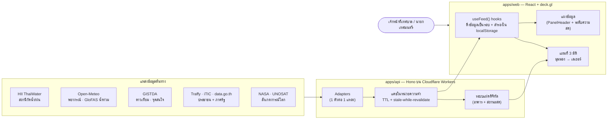
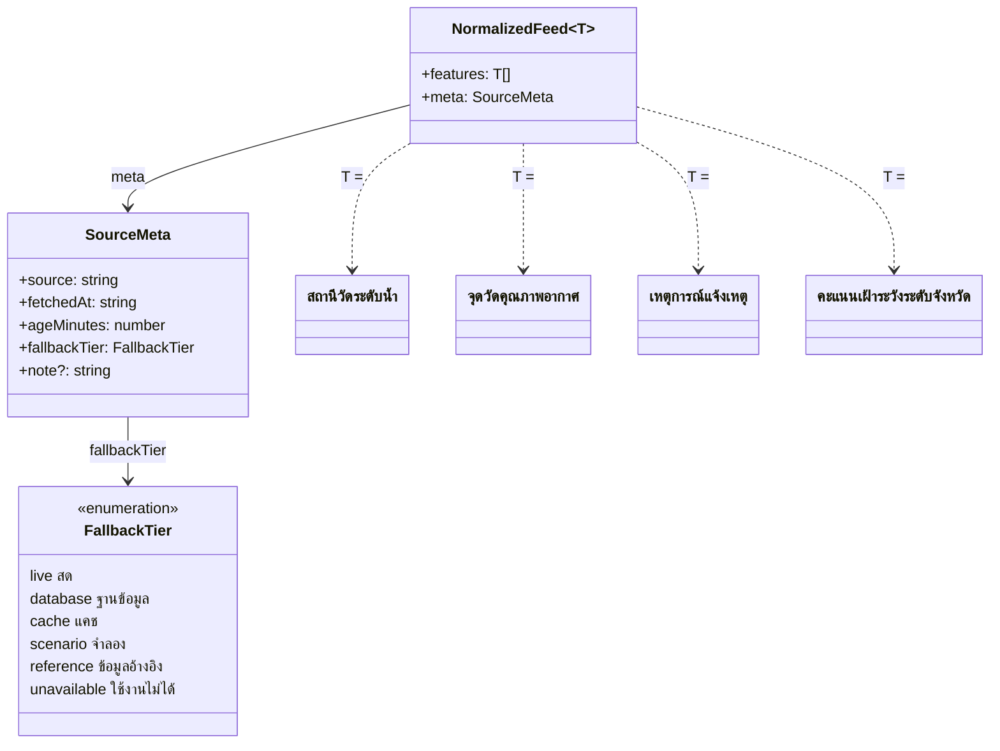
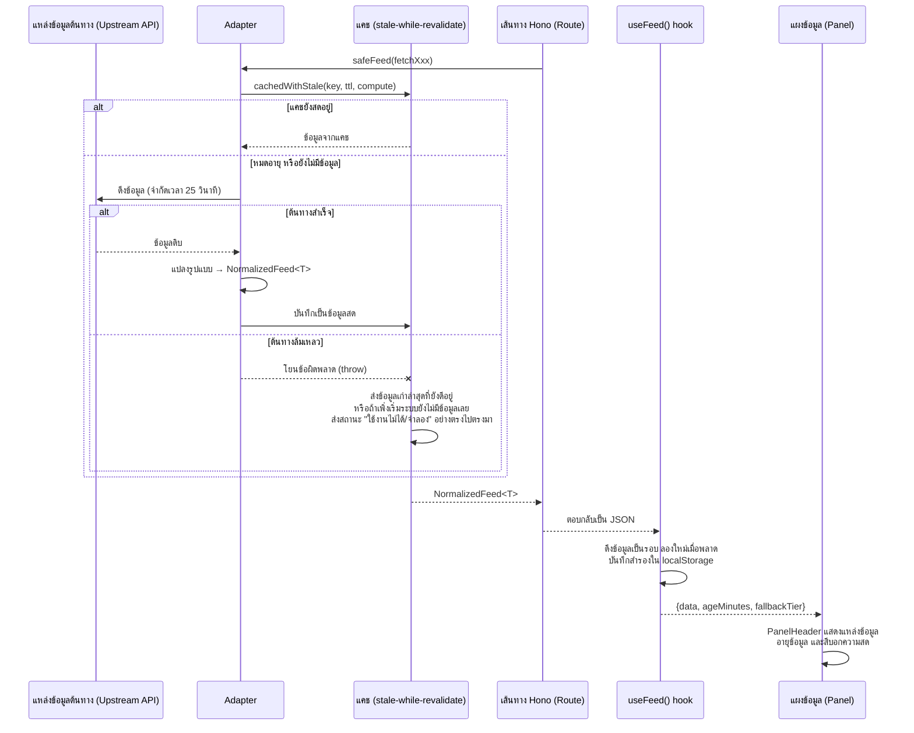

<div align="center">

# แดชบอร์ดเมืองอัจฉริยะ นครศรีธรรมราช
### เทศบาลนครนครศรีธรรมราช — ศูนย์ควบคุมเมือง (Municipal Control Tower)

**แดชบอร์ดข่าวกรองเมืองแบบเรียลไทม์ ฟรีและโอเพนซอร์ส สำหรับเทศบาลนครนครศรีธรรมราช
ภาคใต้ของประเทศไทย — ออกแบบโดยยึด "น้ำท่วม" เป็นแกนหลัก เพราะเป็นความเสี่ยงสำคัญที่สุดของเมือง**

[](https://react.dev)
[](https://deck.gl)
[](https://hono.dev)
[](#พิสูจน์)
[](LICENSE)

🇹🇭 ภาษาไทย (หน้านี้) · **[🇬🇧 English → README.md](README.md)**

</div>

---

## นี่คืออะไร <a id="คืออะไร"></a>

นครศรีธรรมราชตั้งอยู่เชิงเขาหลวง (สูง 1,835 เมตร ยอดเขาที่สูงที่สุดในภาคใต้) ระบบลุ่มน้ำ 3 สาย
ไหลลงจากภูเขา ผ่านย่านเมืองเก่า ลงสู่ลุ่มน้ำปากพนัง — ภูมิประเทศเดียวกับที่เคยเกิดน้ำท่วมใหญ่จาก
พายุโซนร้อนปาบึกในปี 2562 แดชบอร์ดนี้สร้างขึ้นเพื่อตอบคำถามเดียวให้เร็วที่สุดในชั่วโมงที่สำคัญ:
**"ตอนนี้เกิดอะไรขึ้น และควรส่งความช่วยเหลือไปที่ไหน"**

ระบบรวมข้อมูลสดหลายสิบแหล่ง — ระดับน้ำในแม่น้ำ ปริมาณฝน พื้นที่น้ำท่วมจากดาวเทียม คุณภาพอากาศ
จราจร รายงานจากประชาชน เรือ AIS ในทะเล ข้อมูลเปิดภาครัฐ — ลงบนแผนที่ 3 มิติเดียวของเมือง
พร้อมเครื่องมือ **จำลองสถานการณ์น้ำท่วม** ให้ผู้ปฏิบัติงานทดลองว่า "ถ้าระดับน้ำถึงค่า X จะเกิดอะไรขึ้น"
โดยเทียบกับข้อมูลสำรวจระดับถนนจริง ก่อนที่เหตุการณ์จะเกิดขึ้นจริง

**นี่ไม่ใช่ demo** ตัวเลขทุกตัวบนหน้าจอสืบย้อนไปถึงแหล่งข้อมูลจริง หรือระบุชัดเจนว่าเป็นข้อมูลจำลอง/
สถานการณ์สมมติ — ดูหัวข้อ [ความซื่อสัตย์ของข้อมูล](#ความซื่อสัตย์) ด้านล่าง

## พิสูจน์ <a id="พิสูจน์"></a>

| | |
|---|---|
| **1,927** | อาคาร 3 มิติที่แตะดูข้อมูลได้ |
| **70** | แหล่งข้อมูลที่ขึ้นทะเบียน (วันนี้ใช้งานจริง 27 แหล่ง) |
| **1,168** | ชุดทดสอบอัตโนมัติ (unit test) บวก 18 ชุดทดสอบ Playwright แบบจำลองผู้ใช้จริง |
| **9** | มุมมองแผนที่ (lens) — เมืองเดียว หลายมุมมอง |
| **0** | ความลับ (secret) ในซอร์สโค้ด — ทุกคีย์เป็นตัวแปรสภาพแวดล้อม |

## สถาปัตยกรรมระบบ <a id="สถาปัตยกรรม"></a>

โมโนรีโป (monorepo) แบบ pnpm แบ่งเป็น 3 ส่วนงาน:

```
apps/api/         Hono API บน Cloudflare Workers — 1 adapter ต่อ 1 แหล่งข้อมูล
apps/web/         React 19 + Vite + deck.gl + MapLibre — ตัวแดชบอร์ด
packages/shared/  ชนิดข้อมูล TypeScript และค่าคอนฟิกภูมิภาคที่ใช้ร่วมกัน
```


```mermaid
flowchart LR
    subgraph Upstream["แหล่งข้อมูลต้นทาง"]
        HII["HII ThaiWater<br/>สถานีวัดน้ำ/ฝน"]
        OM["Open-Meteo<br/>พยากรณ์ · GloFAS น้ำท่วม"]
        GISTDA["GISTDA<br/>ดาวเทียม · จุดสนใจ"]
        GOV["Traffy · iTIC · data.go.th<br/>ประชาชน + ภาครัฐ"]
        SAT["NASA · UNOSAT<br/>สังเกตการณ์โลก"]
    end

    subgraph API["apps/api — Hono บน Cloudflare Workers"]
        Adapters["Adapters<br/>(1 ตัวต่อ 1 แหล่ง)"]
        Cache["แคชในหน่วยความจำ<br/>TTL + stale-while-revalidate"]
        Twin["ระบบแฝดดิจิทัล<br/>(อาคาร + สถานะสด)"]
    end

    subgraph Web["apps/web — React + deck.gl"]
        Hooks["useFeed() hooks<br/>ดึงข้อมูลเป็นรอบ + สำรองใน localStorage"]
        Panels["แผงข้อมูล<br/>(PanelHeader + ระดับความสด)"]
        Map["แผนที่ 3 มิติ<br/>มุมมอง → เลเยอร์"]
    end

    Upstream --> Adapters --> Cache --> Hooks --> Panels
    Cache --> Twin --> Map
    Hooks --> Map

    Operator(["เจ้าหน้าที่เทศบาล / นายกเทศมนตรี"]) --> Web
```

**รูปแบบ adapter** ทุกแหล่งข้อมูลต้นทางมี adapter เพียง 1 ตัวใน
`apps/api/src/adapters/<name>.ts` โดย adapter จะดึงข้อมูล (มีเวลาจำกัด/timeout)
แปลงรูปแบบข้อมูลให้เป็น `features` ที่มีชนิดชัดเจน ประทับตรา `meta` บอกความสดของข้อมูล
และที่สำคัญที่สุดคือ **ต้อง throw ข้อผิดพลาดเมื่อดึงข้อมูลไม่สำเร็จจริง** แทนที่จะคืนค่าว่างเงียบๆ
เพื่อให้ชั้นแคชสามารถส่งค่าล่าสุดที่ยังใช้ได้ (stale-while-revalidate) แทนการแสดงผลลวงว่า
"ไม่มีปัญหาอะไร"

## สัญญาข้อมูล — `NormalizedFeed<T>` <a id="โครงสร้างข้อมูล"></a>

แหล่งข้อมูลทั้ง 70 แหล่งที่ขึ้นทะเบียน — ไม่ว่าจะเป็นสถานีวัดน้ำ ภาพถ่ายดาวเทียม รายงานประชาชน
หรือข้อมูลตลาดหุ้น — ทุกแหล่งถูกแปลงให้อยู่ใน **รูปแบบเดียวกัน** ก่อนที่จะถึงแผงข้อมูลบนหน้าจอ
นี่คือการตัดสินใจด้านการออกแบบที่สำคัญที่สุดในระบบทั้งหมด: แผงข้อมูลไม่จำเป็นต้องรู้ว่าข้อมูลมาจาก
API ต้นทางแบบไหน


```mermaid
classDiagram
    class NormalizedFeed~T~ {
        +features: T[]
        +meta: SourceMeta
    }
    class SourceMeta {
        +source: string
        +fetchedAt: string
        +ageMinutes: number
        +fallbackTier: FallbackTier
        +note?: string
    }
    class FallbackTier {
        <<enumeration>>
        live สด
        database ฐานข้อมูล
        cache แคช
        scenario จำลอง
        reference ข้อมูลอ้างอิง
        unavailable ใช้งานไม่ได้
    }
    NormalizedFeed --> SourceMeta : meta
    SourceMeta --> FallbackTier : fallbackTier

    class FloodGauge["สถานีวัดระดับน้ำ"]
    class AirQualityPoint["จุดวัดคุณภาพอากาศ"]
    class IncidentFeature["เหตุการณ์แจ้งเหตุ"]
    class ProvinceWatchScore["คะแนนเฝ้าระวังระดับจังหวัด"]
    NormalizedFeed ..> FloodGauge : T =
    NormalizedFeed ..> AirQualityPoint : T =
    NormalizedFeed ..> IncidentFeature : T =
    NormalizedFeed ..> ProvinceWatchScore : T =
```

เส้นทางเดินทางของข้อมูล 1 ชุด ตั้งแต่ต้นทางถึงหน้าจอ:


```mermaid
sequenceDiagram
    participant U as แหล่งข้อมูลต้นทาง (Upstream API)
    participant A as Adapter
    participant C as แคช (stale-while-revalidate)
    participant R as เส้นทาง Hono (Route)
    participant H as useFeed() hook
    participant P as แผงข้อมูล (Panel)

    R->>A: safeFeed(fetchXxx)
    A->>C: cachedWithStale(key, ttl, compute)
    alt แคชยังสดอยู่
        C-->>A: ข้อมูลจากแคช
    else หมดอายุ หรือยังไม่มีข้อมูล
        A->>U: ดึงข้อมูล (จำกัดเวลา 25 วินาที)
        alt ต้นทางสำเร็จ
            U-->>A: ข้อมูลดิบ
            A->>A: แปลงรูปแบบ → NormalizedFeed<T>
            A->>C: บันทึกเป็นข้อมูลสด
        else ต้นทางล้มเหลว
            A--xC: โยนข้อผิดพลาด (throw)
            C->>C: ส่งข้อมูลเก่าล่าสุดที่ยังดีอยู่<br/>หรือถ้าเพิ่งเริ่มระบบยังไม่มีข้อมูลเลย<br/>ส่งสถานะ "ใช้งานไม่ได้/จำลอง" อย่างตรงไปตรงมา
        end
    end
    C-->>R: NormalizedFeed<T>
    R-->>H: ตอบกลับเป็น JSON
    H->>H: ดึงข้อมูลเป็นรอบ ลองใหม่เมื่อพลาด<br/>บันทึกสำรองใน localStorage
    H-->>P: {data, ageMinutes, fallbackTier}
    P->>P: PanelHeader แสดงแหล่งข้อมูล<br/>อายุข้อมูล และสีบอกความสด
```

## ความซื่อสัตย์ของข้อมูล: จริง vs. จำลอง <a id="ความซื่อสัตย์"></a>

ข้อมูลทุกจุดบนหน้าจอมีป้ายกำกับ `fallbackTier` และ UI จะแสดงป้ายนี้เสมอ — ไม่มีข้อมูลจำลองใด
ถูกแสดงราวกับเป็นข้อมูลสด

| ระดับ | ความหมาย |
|---|---|
| `live` (สด) | ข้อมูลจริงจากเซนเซอร์/API ที่ดึงมาภายในช่วงเวลาที่กำหนด |
| `database` (ฐานข้อมูล) | บันทึกในฐานข้อมูล Postgres ของระบบแฝดดิจิทัล — ข้อมูลอ้างอิงหลัก |
| `cache` (แคช) | ค่าล่าสุดที่ยังดีอยู่ ดึงจาก localStorage ของเบราว์เซอร์ระหว่างรอข้อมูลใหม่ |
| `reference` (ข้อมูลอ้างอิง) | ชุดข้อมูลสถิติ/ประวัติศาสตร์ (เช่น ความถี่น้ำท่วมจากดาวเทียมย้อนหลัง 17 ปี) — ไม่อัปเดตสด |
| `scenario` (จำลอง) | ผลจากแบบจำลอง เช่น เครื่องมือจำลองน้ำท่วม หรือกริดพยากรณ์ฝน |
| `unavailable` (ใช้งานไม่ได้) | แหล่งข้อมูลล่มและไม่มีแคชสำรอง — แสดงเป็นข้อผิดพลาดตรงไปตรงมา ไม่มีการปลอมข้อมูล |

## มุมมองแผนที่ (Lens) — เมืองเดียว หลายมุมมอง <a id="มุมมอง"></a>

| มุมมอง | วัตถุประสงค์ |
|---|---|
| **EXEC** | ภาพรวมเชิงยุทธศาสตร์ — เขตเทศบาล ตัวชี้วัดระดับเมือง |
| **OPS** | ปฏิบัติการประจำวัน — อาคารทุกหลังแบบ 3 มิติ จราจร เหตุการณ์ กล้อง CCTV |
| **FLOOD** | ความเสี่ยงหลักของเมือง — สถานีวัดน้ำ รอยน้ำท่วมที่สำรวจจริง เครื่องมือจำลองสถานการณ์ พื้นที่น้ำท่วมจากดาวเทียม และคะแนนเฝ้าระวังระดับภาคใต้ |
| **MOB** | การจราจร/การสั่งการ — โครงข่ายถนน ระบบขนส่ง heatmap จราจร |
| **ENV** | สิ่งแวดล้อม — พื้นที่เสี่ยงน้ำท่วม คลอง การใช้ที่ดิน คุณภาพอากาศ ศักยภาพพลังงานแสงอาทิตย์ |
| **EAR** | สังเกตการณ์โลก — ฝน ความร้อน พืชพรรณจากดาวเทียม |
| **SAF** | ความปลอดภัย — พื้นที่น้ำท่วม รายงานประชาชน โรงพยาบาล/ดับเพลิง/ตำรวจ |
| **VIB** | โหมดนำเสนอ — ภาพถ่ายดาวเทียมสีจริงสำหรับบรรยายสรุป |
| **INT** | พยากรณ์อัจฉริยะ — เลเยอร์พยากรณ์ฝน/น้ำท่วมล่วงหน้า |

## เลเยอร์เฝ้าระวังภาคใต้ <a id="flooddash"></a>

นอกเหนือจากการติดตามระดับท้องถิ่นของนครศรีธรรมราชแล้ว มุมมอง **FLOOD** ยังมีข้อมูลเฝ้าระวัง
ครอบคลุมทั้งคาบสมุทรภาคใต้: คะแนนเฝ้าระวังของทั้ง 14 จังหวัดภาคใต้ (ระดับน้ำ 50% ·
ปริมาณฝนสะสม 30% · พยากรณ์ 20%) และข้อมูลอัตราการไหลของแม่น้ำแบบ GloFAS ครอบคลุม 5 จุดสำคัญ
(หาดใหญ่ ตาปี ปัตตานี ท่าดี ปากพนัง) ตรรกะนี้พอร์ตมาจากระบบติดตามน้ำท่วมอิสระอีกชุดหนึ่ง
ที่ผ่านการตรวจสอบแล้ว โดยปรับให้ทำงานกับแหล่งข้อมูลต้นทางสดชุดเดียวกัน โดยไม่ต้องพึ่งพา
เซิร์ฟเวอร์ภายนอกใดๆ

## เริ่มต้นใช้งาน <a id="เริ่มต้น"></a>

```bash
pnpm install
pnpm dev                    # ทุกส่วนงาน
# หรือแยกทีละส่วน:
pnpm --filter web dev       # ฝั่งหน้าเว็บ → http://localhost:5173
pnpm --filter api dev       # ฝั่ง API   → http://localhost:3000 (wrangler dev)
```

```bash
pnpm tsc --noEmit                    # ตรวจสอบชนิดข้อมูลทั้งระบบ
pnpm --filter @nst/shared test       # 40 ชุดทดสอบ
pnpm --filter @nst/api test          # 554 ชุดทดสอบ
pnpm --filter @nst/web test          # 574 ชุดทดสอบ
pnpm --filter @nst/web test:e2e      # 18 ชุดทดสอบ Playwright จำลองผู้ใช้จริง
```

ระบบ CI (`.github/workflows/test.yml`) รันตรวจชนิดข้อมูล + unit test + E2E ทุกครั้งที่มี PR
และจะ deploy ขึ้น Cloudflare Pages/Workers ก็ต่อเมื่อ Test workflow ผ่านเท่านั้น

## นำไปใช้กับเมืองของคุณ <a id="fork"></a>

ระบบนี้ออกแบบให้ไม่ผูกติดกับภูมิศาสตร์ใดภูมิศาสตร์หนึ่ง หากต้องการนำไปปรับใช้กับเทศบาลอื่น:

1. **ค่าคอนฟิกภูมิภาค** — `packages/shared/src/campus.ts` (จุดศูนย์กลาง ขอบเขต ชื่อเมือง)
2. **อาคาร** — วางไฟล์ OSM building GeoJSON ของเมืองคุณที่ `apps/web/public/geo/<city>/`
3. **ทะเบียนแหล่งข้อมูล** — ตัดหรือเพิ่มรายการใน `packages/shared/src/sources.ts`
4. **การเชื่อมสถานะสุขภาพระบบ** — อัปเดต `API_PATH_TO_ADAPTER` ใน
   `apps/web/src/lib/sourceCatalog.ts` เพื่อให้หน้าต่าง SOURCES ติดตามสถานะของเส้นทางใหม่ได้

รายละเอียดเชิงลึก: [`docs/ARCHITECTURE.md`](docs/ARCHITECTURE.md) ·
[`docs/DATA-SOURCES.md`](docs/DATA-SOURCES.md) · แนวทางการเขียนโค้ดใน [`CLAUDE.md`](CLAUDE.md)

## สัญญาอนุญาตและเครดิต

สัญญาอนุญาต MIT — ดู [`LICENSE`](LICENSE) ข้อมูลเป็นกรรมสิทธิ์ของผู้ให้บริการแต่ละราย: HII
(สถาบันสารสนเทศทรัพยากรน้ำ) Open-Meteo GISTDA NASA UNOSAT/UNITAR data.go.th Traffy Fondue
OpenStreetMap และแหล่งอื่นๆ — ดูรายการทั้งหมดพร้อมสถานะสุขภาพแบบสดได้ในหน้าต่าง SOURCES
ภายในแอป
