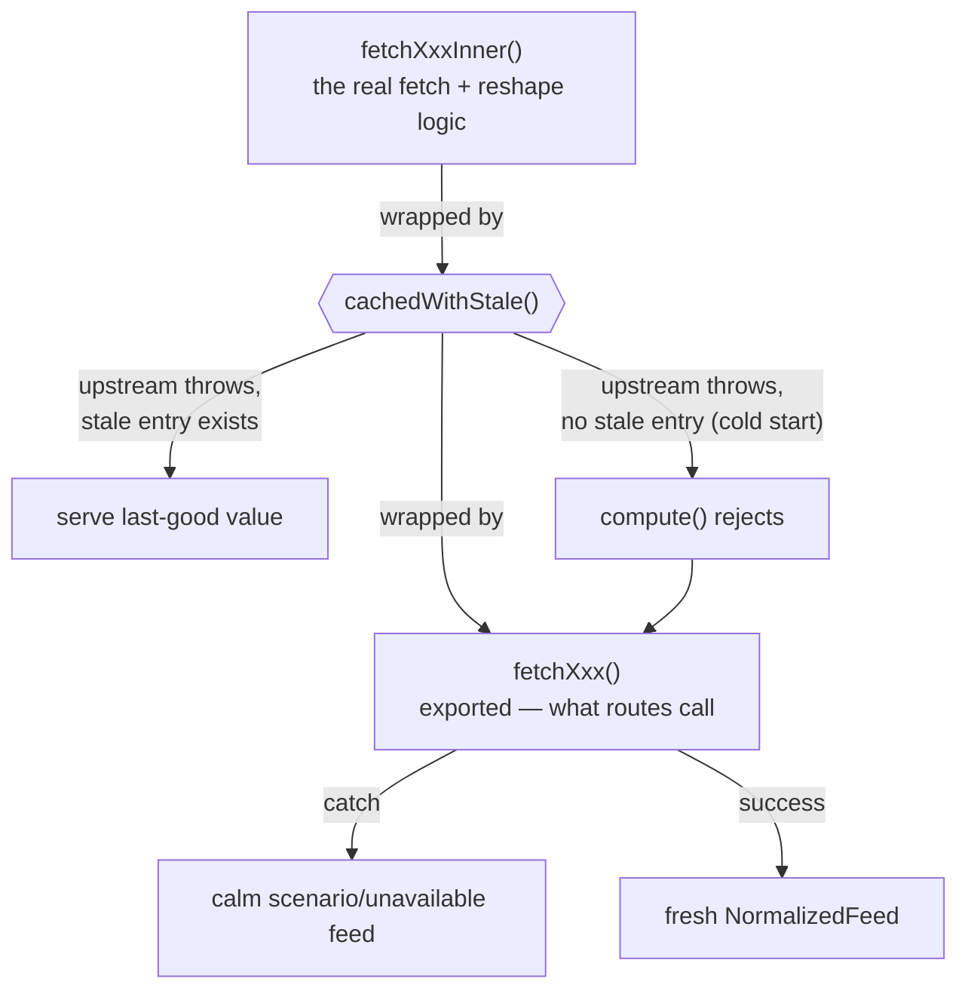
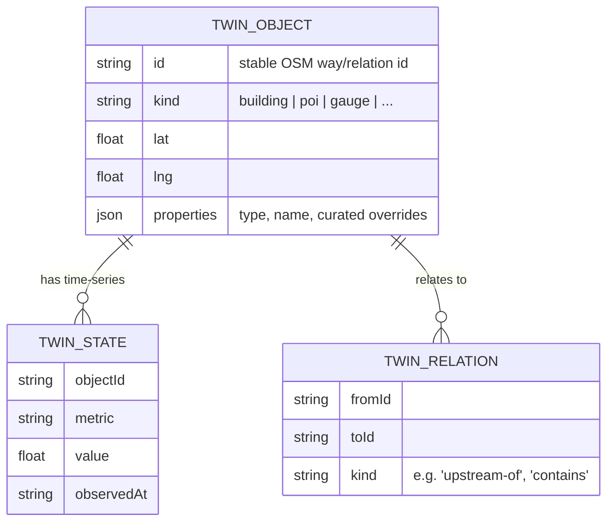

# Architecture

> English, for developers and AI. High-level system + data-structure diagrams are in the
> repo's [`README.md`](../README.md) / [`README.th.md`](../README.th.md); this doc goes
> deeper on the pieces a contributor actually touches.

The NST dashboard is a **pnpm monorepo**. One engine, re-pointable at any city — it
started as a fork of a sibling project and has since been fully re-scoped to Nakhon Si
Thammarat.

```
apps/api/         Hono API (Cloudflare Workers + a long-lived Node mode) — data adapters + the digital-twin store
apps/web/         React 19 + Vite + deck.gl + MapLibre dashboard
packages/shared/  Shared TypeScript types + utilities (types.ts, locale.ts, campus.ts, sources.ts)
```

## The data contract — `NormalizedFeed<T>`

Every API route returns the same envelope. Panels never see a raw upstream payload.

```ts
interface NormalizedFeed<T> {
  features: T[];
  meta: SourceMeta;   // source, fetchedAt, ageMinutes, fallbackTier, note?
}
```

This is the spine of the system: a panel only has to understand one shape, and every feed
can be rendered, aged, and health-checked uniformly. See the README for the full sequence
diagram of a feed's round trip.

## Adapters — the error-handling contract that actually matters

Each upstream source has one adapter in `apps/api/src/adapters/<name>.ts`. The contract is
stricter than it looks:

1. Fetch the upstream source through `fetchJsonOrThrow` (`adapters/common.ts`) — a 25s
   timeout, redacted logging, and **it must actually throw** on failure (non-OK status,
   network error, malformed JSON). This is not optional: the whole stale-cache fallback
   design depends on the promise rejecting.
2. Reshape the payload into typed `features`.
3. Stamp `meta` — source name, fetch time, age, and a `fallbackTier`.
4. Wrap the cache call in a `try/catch` at the *outer*, exported function — so a cold start
   with no stale data to fall back on degrades to a calm `scenario`/`unavailable` feed
   instead of a raw 500 through `safeFeed`. See any adapter's `fetchXxxInner` /
   `fetchXxx` pair for the pattern.



Adding a source = adding one adapter + one route + a unit test asserting the contract
(including the cold-start-failure path — this is the single most common class of bug
found in this codebase's own hardening passes).

## Fallback tiers — graceful degradation

The dashboard never goes blank. Every feed declares how fresh it is, and the UI colours it:

| Tier | Meaning | UI |
|---|---|---|
| `live` | fresh from upstream | green |
| `cache` | last good value, still recent | gold |
| `scenario` | model output / simulated | orange, labelled `MODELLED` |
| `reference` | static historical dataset | neutral |
| `unavailable` | source down, env var missing | red, with a `meta.note` explaining why |

`safeFeed` treats `unavailable` as a health error so it surfaces in the SOURCES catalog
(`packages/shared/src/sources.ts` + `apps/web/src/lib/sourceCatalog.ts`'s
`API_PATH_TO_ADAPTER` mapping — every route must appear in both, or a degraded adapter
fails silently in the UI).

## Caching — `cache.ts`

Two entry points, both backed by one in-memory `Map` per Worker isolate:

- `cached(key, ttlSeconds, compute)` — plain TTL cache; a fresh cache miss awaits
  `compute()` directly.
- `cachedWithStale(key, ttlSeconds, compute, staleTtlSeconds, serveStaleWhileRevalidate?)`
  — on expiry, serves the previous value immediately (`serveStaleWhileRevalidate: true`)
  or falls back to it only if the fresh fetch fails. Either way, both functions race
  `compute()` against a 60s safety timeout (`raceAgainstHang`) — a hung upstream call must
  never leave a caller waiting forever, a real failure mode this codebase has hit in
  production.

Eviction is LRU (`MAX_ENTRIES = 200`): every read and write touches a key to the
most-recently-used end of the Map, so eviction genuinely drops the coldest entry, not just
the oldest-inserted one.

## The digital twin

Buildings (and other city objects) are hydrated into an in-memory twin store
(`apps/api/src/lib/twinStore.ts`) from building GeoJSON, and optionally persisted to
Postgres/PostGIS. Each object has a stable id (the OSM way/relation id), a properties bag,
relations, and time-series state — exposed under `/api/twin/*`.



To persist: create a Postgres database (e.g. Supabase), enable `postgis`, run
`apps/api/src/lib/twinSchema.sql`, and set `SUPABASE_DB_URL` (or `DATABASE_URL`) in
`apps/api/.env`. Without a database the twin runs fully in memory and re-hydrates from
building GeoJSON on restart.

## The web layer

- **Map** — `DeckGL` (deck.gl) wrapping `MapLibreMap` (`react-map-gl/maplibre`). The
  camera is **uncontrolled** (`initialViewState`, not `viewState`) so drag/zoom isn't
  gated behind a full React re-render — a deliberate fix after the controlled pattern
  caused visible input lag regardless of GPU.
- **Lenses → layers** — `apps/web/src/map/presets.ts` maps each lens (`EXEC · OPS · FLOOD
  · MOB · ENV · EAR · SAF · VIB · INT`) to a set of enabled layer ids; `App.tsx`'s big
  `layers` `useMemo` builds the actual deck.gl layer instances from whatever's enabled.
  High-frequency layers (flood scenario slider, flow animation) are deliberately composed
  *outside* that memo so a slider drag doesn't rebuild all ~30 other layers per frame.
- **Buildings** — a `GeoJsonLayer` (extruded), coloured by type via `lib/building.ts` +
  `map/layers.ts`. Untyped footprints render neutral; a curated override can win over raw
  OSM tags.
- **Panels** — every panel starts with `<PanelHeader>` (title, source, age, freshness
  colour) and consumes a `NormalizedFeed` via the `useFeed()` hook in `App.tsx`. `useFeed`
  polls on an interval, retries with backoff, and persists the last value to
  `localStorage` so a page reload doesn't show a blank panel while refetching. **Poll
  intervals must stay under ~24.8 days** — `setInterval` silently overflows past its
  32-bit-ms ceiling and fires immediately/repeatedly instead; `useFeed` clamps this
  defensively, but a bad literal here has caused a real production incident (a feed
  hammering its endpoint roughly once a second instead of once a month).
- **Mobile** — a three-tab shell (Map · Brief · Layers) below a responsive breakpoint.

## Runtime & tests

- The API runs as a Cloudflare Worker in production, and as a long-lived Node process
  (`apps/api/src/node.ts`) for local development — the same adapters, cache, and twin
  store work in both.
- `pnpm tsc --noEmit` type-checks the whole repo (note: passing `tsc --noEmit` does not
  guarantee the strict build — `tsc -b` — also passes; both are run in CI).
- `pnpm --filter @nst/shared test` / `@nst/api test` / `@nst/web test` run the unit
  suites; `@nst/web test:e2e` runs Playwright smoke tests. CI runs type-check + unit + E2E
  on every PR; deploy only runs after Test passes.

See [`CLAUDE.md`](../CLAUDE.md) for the full coding conventions (PanelHeader, design
tokens, freshness classes, file-size limits) and [`docs/DATA-SOURCES.md`](DATA-SOURCES.md)
for the complete, categorised source catalog.
